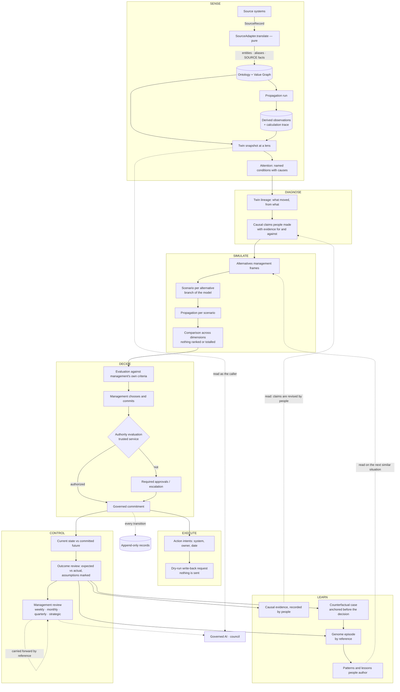
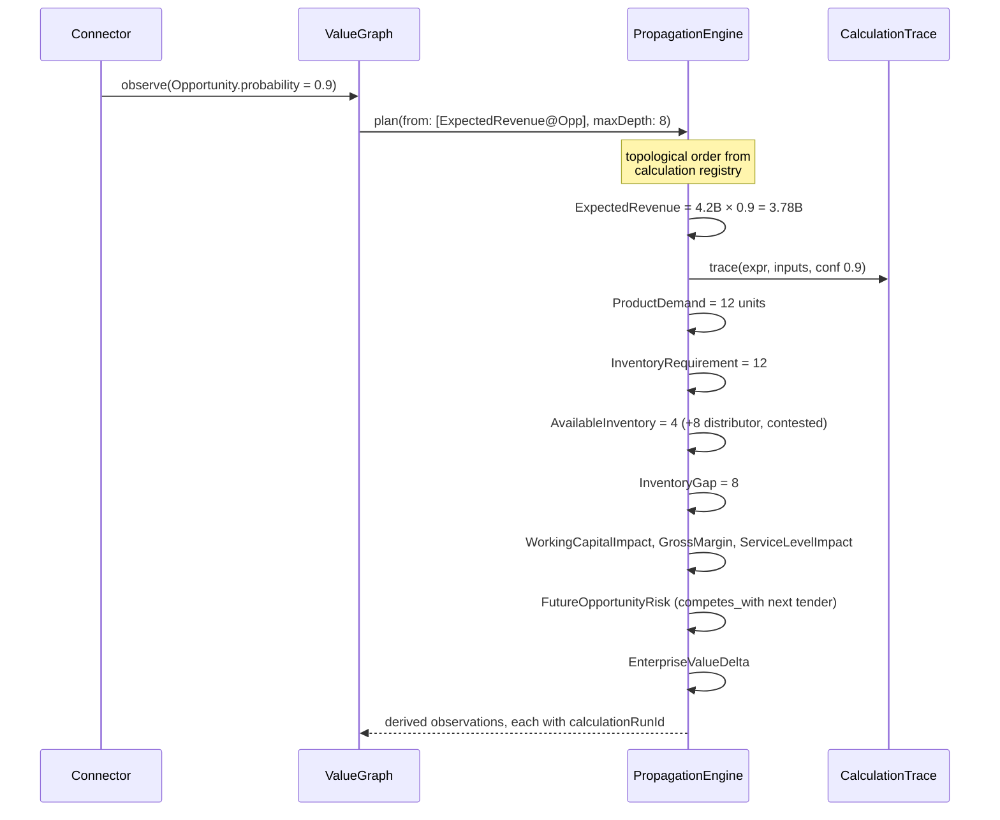
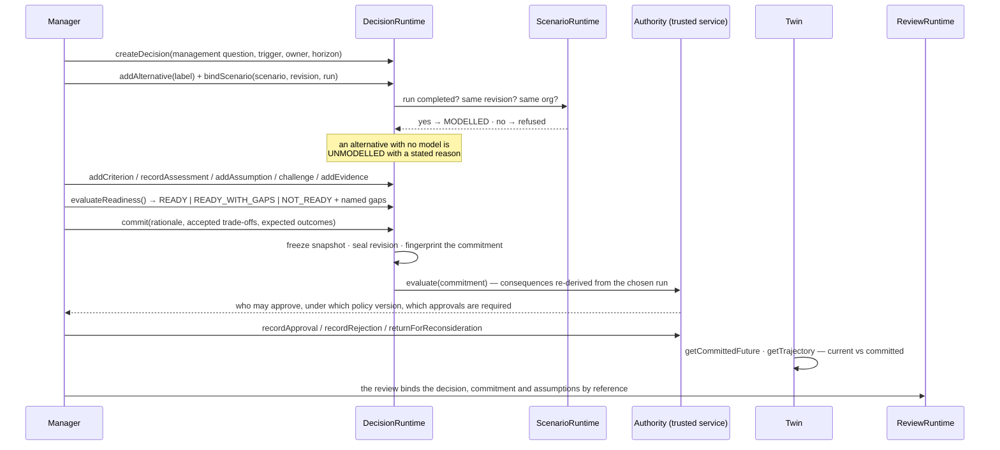
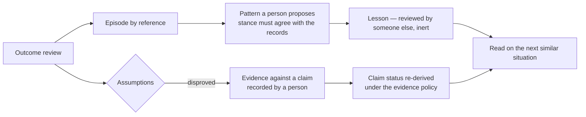

# Data Flow

How information enters HELM, becomes management truth, and returns as a decision, a
review and a lesson. The layers themselves are in
[helm-architecture.md](helm-architecture.md).

## 1. The operating loop

```
SENSE → DIAGNOSE → SIMULATE → DECIDE → EXECUTE → CONTROL → LEARN → (and back to SENSE)
```

Every arrow is a data transformation with a contract, and the loop closes **through
people**: what is learned is recorded as memory and beliefs that people author and
review, and that the next decision and the next review can *read*. Nothing learned
rewrites the model, a formula, a weight or an authority rule by itself.



The dotted lines back are the point, and they are all *reads* or *authored records*.
HELM remembers with reasons and reproduces any closed review; it is not a system that
quietly recalibrates itself.

## 2. Ingestion — source fact to ontology

```mermaid
sequenceDiagram
    participant SRC as Memoire
    participant R as MemoireReader (caller's RLS)
    participant P as IngestionPipeline
    participant A as SourceAdapter
    participant G as GraphStore
    participant V as ValueGraph
    participant L as Sync ledger

    P->>L: checkpointOf(memoire) — derived from the ledger
    P->>R: rows strictly after the checkpoint
    R-->>P: SourceRecord[]
    P->>P: detectDrift(contract, records)
    alt BREAKING
        P->>L: append BLOCKED_BY_DRIFT — checkpoint holds, nothing written
    else NONE or ADDITIVE
        loop each record
            P->>A: translate(record) — pure
            A-->>P: entities · relationships · aliases · SOURCE facts
            alt cannot translate
                P->>L: quarantine — the checkpoint holds
            else
                P->>G: write only what differs; register aliases
                P->>V: record a SOURCE observation only if the value differs
            end
        end
        P->>L: append the run: counts · drift · quarantined · cursor
    end
```

Guarantees:

- **Idempotent by content.** An entity is written only if it differs, an observation
  only if its value differs, an alias only if new; a blank checkpoint re-reading
  everything changes nothing.
- **Non-destructive.** A changed value is a new observation and the earlier one stays.
- **Provenance-stamped.** Every fact traces to its ingestion event, connector and source
  object.
- **Source-typed.** A source can only say `ACTUAL`, `FORECAST` or `TARGET`; a model
  estimate of the same quantity sits beside it and neither overwrites the other.
- **Stops rather than guesses.** Breaking drift blocks the object type; a record HELM
  cannot take is quarantined and holds the checkpoint.
- **Vocabulary-confined.** The kernel never sees `estimated_value` or `account_name` —
  only the ontology's terms.

## 3. Propagation — a change becomes consequences

Probability moves 70% → 90% on the canonical opportunity:



Rules:

- **Order comes from the registry**, never from hand-written sequences. A cycle
  is an error at `plan()`, before anything executes.
- **Confidence degrades monotonically.** A derived value is never more confident
  than its weakest input.
- **Every output is traced.** No number exists without a `calculationRunId`.
- **Reality is untouched during scenario runs.** Scenario observations carry a
  `scenarioId`; `NULL` is reality.

## 4. Simulation — options as sparse overlays

An option is not a copy of the graph. It is a small set of overrides:

| Option | Overrides |
| --- | --- |
| A — Expedite import | `Shipment.lag` 21d → 7d; `LandedCost` +freight premium |
| B — Reallocate distributor stock | `AvailableInventory` +8; `FutureOpportunityRisk` on the competing tender |
| C — Alternative product | `sells` edge → SKU-Y; margin and service deltas |
| D — Delay delivery | `ServiceLevelImpact` down; opportunity probability down |
| E — Combination | union of A and B overrides |

Each option runs the same propagation with its `scenarioId`, producing the same
metric set — so comparison is apples to apples by construction, across revenue,
gross margin, working capital, service level, inventory risk, future-opportunity
risk, cash, strategic alignment and confidence.

This is why overrides live on relationships and observations rather than in a
duplicated subgraph: adding an option is O(overrides), not O(graph).

## 5. Decision, authority and review



Every step writes an append-only record: history cannot be rewritten from a client, by
anyone, including an admin. **Authority is a separate, immutable evaluation** bound to the
commitment fingerprint, computed by the trusted service and never asserted by a client;
recording a commitment is history even when the person was not authorized to, so the
evaluation says *whose* authority it needs instead of the record disappearing.

HELM writes nothing into another system. A governed commitment produces **action
intents** naming the system that should act; the integration fabric turns an explicit
intent into a dry-run request that says nothing was sent
([ADR-0030](../adr/0030-integration-fabric.md)).

## 6. Learning — the loop closes through people

At **outcome review**, each expected outcome is compared with the actual and the variance
is stated, and each assumption is marked `CONFIRMED`, `PARTIALLY_CONFIRMED`, `DISPROVED`
or `UNKNOWN`, against the sealed revision. The review passes no judgement: [decision
quality is not outcome quality](decision-quality-vs-outcome.md).

From there, and only by people's acts:

1. **Causal evidence.** A disproved assumption can be recorded as evidence *against* a
   causal claim it rested on; the claim's status is *derived* under the evidence policy
   (an ordinary count never decides) and revised by a person
   ([ADR-0026](../adr/0026-enterprise-causal-graph.md)).
2. **A counterfactual case** anchored to the state *before* the decision, estimated as
   known then and with hindsight, four layers side by side, no regret
   ([ADR-0029](../adr/0029-counterfactual-worlds.md)).
3. **A genome episode** that wraps the decision by reference (situation as known at the
   boundary; beliefs of the day apart from those since), with patterns and lessons that
   people propose and someone else reviews ([ADR-0028](../adr/0028-management-genome.md)).
4. **The next management review**, prepared with what changed since the last one closed,
   inheriting what it left open by reference, reproducible ever after
   ([ADR-0031](../adr/0031-management-reviews.md)).



Nothing in HELM lowers a claim's status by itself, adjusts a link weight, mines a pattern
or acts on a lesson. The pre-kernel `decisionMemory` engine learned from `outcomeScore`, a
grade of the decision by its outcome — the one thing HELM must not keep — and was retired.

## 7. What the manager sees at the end of the chain

Clicking "why 4.2B revenue at risk?" walks the same data backwards:

```
EnterpriseValueDelta  −1.1B            [calculation_run 7f3a, 2026-09-19 08:14]
└─ CashImpact  −840M                   conf 0.63
   └─ WorkingCapitalImpact  +1.4B      conf 0.70
      └─ InventoryGap  8 units         conf 0.70
         ├─ InventoryRequirement 12    ← ProductDemand × 1.0
         │  └─ ProductDemand 12 units  ← sells edge weight, memoire:opp:123
         │     └─ ExpectedRevenue 2.94B = 4.2B × 0.70
         │        └─ Opportunity 4.2B  ← memoire · opportunities · 123
         │           observed 2026-09-18 11:02, conf 0.70
         └─ AvailableInventory 4       ← helm · inventory_items · SKU-X
                                         observed 2026-09-19 06:00, conf 1.0
   Assumptions: freight at standard rate (high sensitivity)
                distributor stock not committed elsewhere (high sensitivity)
```

Every line is a stored row: a calculation trace entry, an observation, a
provenance record. Nothing on this screen is reconstructed by the UI, and nothing
is narrated by a model.
