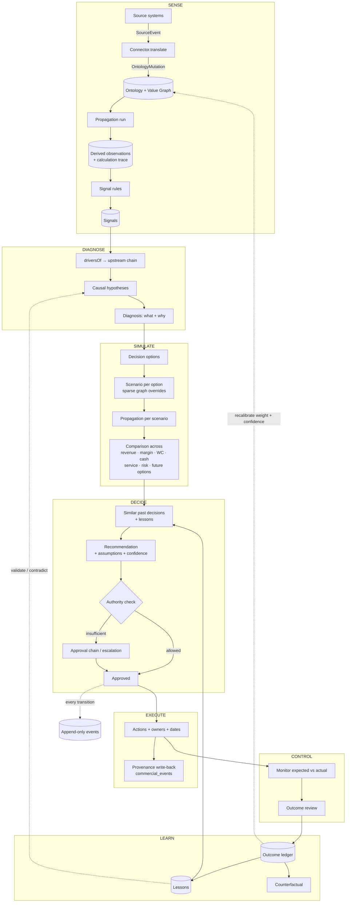
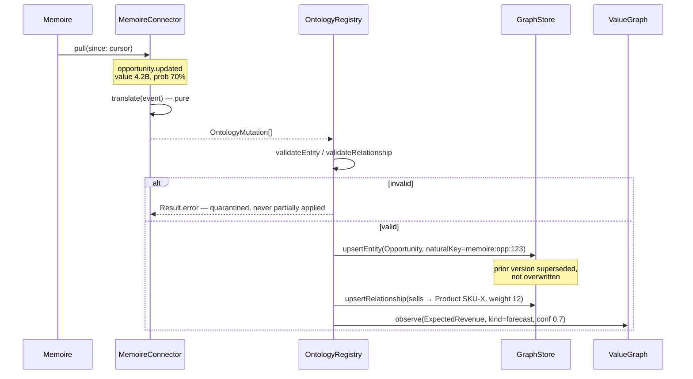
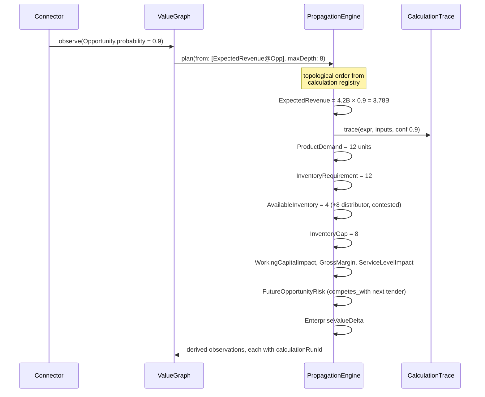
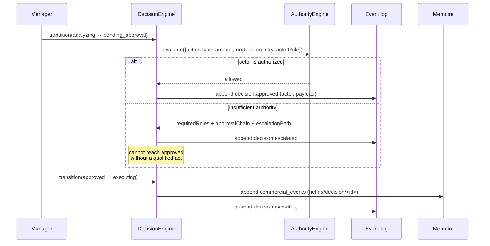
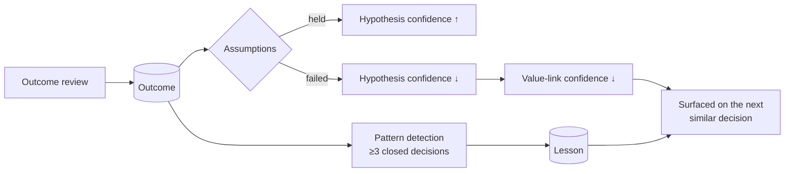

# Data Flow

How information enters HELM, becomes management truth, and returns as a decision
and a lesson.

## 1. The operating loop

```
SENSE → DIAGNOSE → SIMULATE → DECIDE → EXECUTE → CONTROL → LEARN
```

Every arrow is a data transformation with a contract. The loop closes: LEARN
writes back into the model that SENSE reads, which is what makes the
organization compound rather than merely record.



The two dotted lines back into `CAUSAL` and `GRAPH` are the whole point. Without
them HELM is a decision log; with them it is infrastructure that gets better at
the enterprise it manages.

## 2. Ingestion — source fact to ontology



Guarantees:

- **Idempotent.** `naturalKey` unique per `(orgId, typeCode)`; replaying an event
  changes nothing.
- **Non-destructive.** An update closes the prior row's validity window.
- **Provenance-stamped.** Every row records the system, reference and observation
  time.
- **Atomic per event.** A rejected mutation leaves no partial write.
- **Vocabulary-confined.** The kernel never sees `estimated_value` or
  `account_name` — only `Opportunity.attributes.value`.

## 3. Propagation — a change becomes consequences

Probability moves 70% → 90% on the canonical opportunity:



Rules:

- **Order comes from the registry**, never from hand-written sequences. A cycle
  is an error at `plan()`, before anything executes.
- **Confidence degrades monotonically.** A derived value is never more confident
  than its weakest input.
- **Every output is traced.** No number exists without a `calculationRunId`.
- **Reality is untouched during scenario runs.** Scenario observations carry a
  `scenarioId`; `NULL` is reality.

## 4. Simulation — options as sparse overlays

An option is not a copy of the graph. It is a small set of overrides:

| Option | Overrides |
| --- | --- |
| A — Expedite import | `Shipment.lag` 21d → 7d; `LandedCost` +freight premium |
| B — Reallocate distributor stock | `AvailableInventory` +8; `FutureOpportunityRisk` on the competing tender |
| C — Alternative product | `sells` edge → SKU-Y; margin and service deltas |
| D — Delay delivery | `ServiceLevelImpact` down; opportunity probability down |
| E — Combination | union of A and B overrides |

Each option runs the same propagation with its `scenarioId`, producing the same
metric set — so comparison is apples to apples by construction, across revenue,
gross margin, working capital, service level, inventory risk, future-opportunity
risk, cash, strategic alignment and confidence.

This is why overrides live on relationships and observations rather than in a
duplicated subgraph: adding an option is O(overrides), not O(graph).

## 5. Decision and authority



Every transition writes to `helm_decision_events`, which has INSERT and SELECT
policies and deliberately **no UPDATE or DELETE** — history cannot be rewritten
from a client, by anyone, including an admin.

## 6. Learning — the loop closes on the model

At outcome review, expected is compared with actual and three writes follow:

1. **Outcome ledger** — expected, actual, score, lesson.
2. **Assumption validation** — each assumption marked `held` or `failed`. A
   failed assumption is evidence against any causal hypothesis it rested on, and
   `reassess()` lowers that hypothesis's confidence.
3. **Graph recalibration** — systematic error in a calculation's output adjusts
   the confidence (and, with enough evidence, the weight) of the links involved.



The threshold matters: `decisionMemory.ts` already requires **at least three
closed decisions with two-thirds agreement** before asserting a pattern. Learning
that fires on a single outcome is superstition, and the engine is built to refuse
it.

## 7. What the manager sees at the end of the chain

Clicking "why 4.2B revenue at risk?" walks the same data backwards:

```
EnterpriseValueDelta  −1.1B            [calculation_run 7f3a, 2026-09-19 08:14]
└─ CashImpact  −840M                   conf 0.63
   └─ WorkingCapitalImpact  +1.4B      conf 0.70
      └─ InventoryGap  8 units         conf 0.70
         ├─ InventoryRequirement 12    ← ProductDemand × 1.0
         │  └─ ProductDemand 12 units  ← sells edge weight, memoire:opp:123
         │     └─ ExpectedRevenue 2.94B = 4.2B × 0.70
         │        └─ Opportunity 4.2B  ← memoire · opportunities · 123
         │           observed 2026-09-18 11:02, conf 0.70
         └─ AvailableInventory 4       ← helm · inventory_items · SKU-X
                                         observed 2026-09-19 06:00, conf 1.0
   Assumptions: freight at standard rate (high sensitivity)
                distributor stock not committed elsewhere (high sensitivity)
```

Every line is a stored row: a calculation trace entry, an observation, a
provenance record. Nothing on this screen is reconstructed by the UI, and nothing
is narrated by a model.
