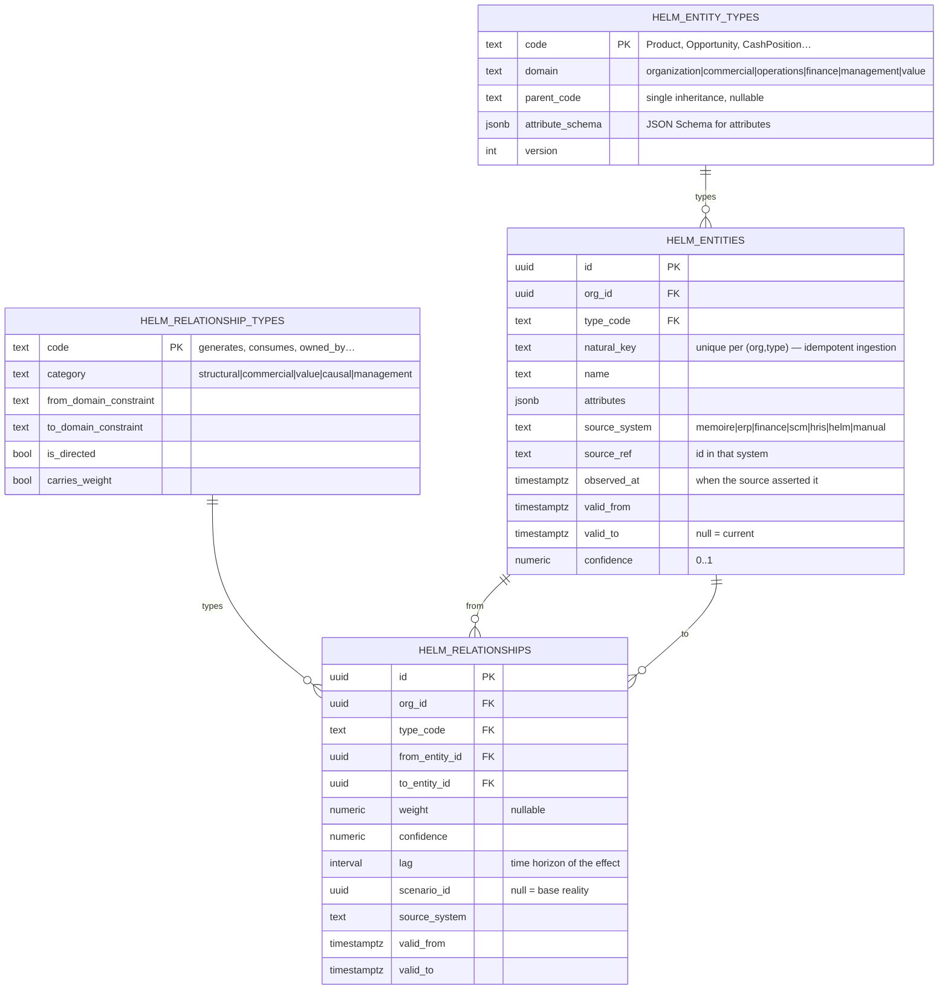
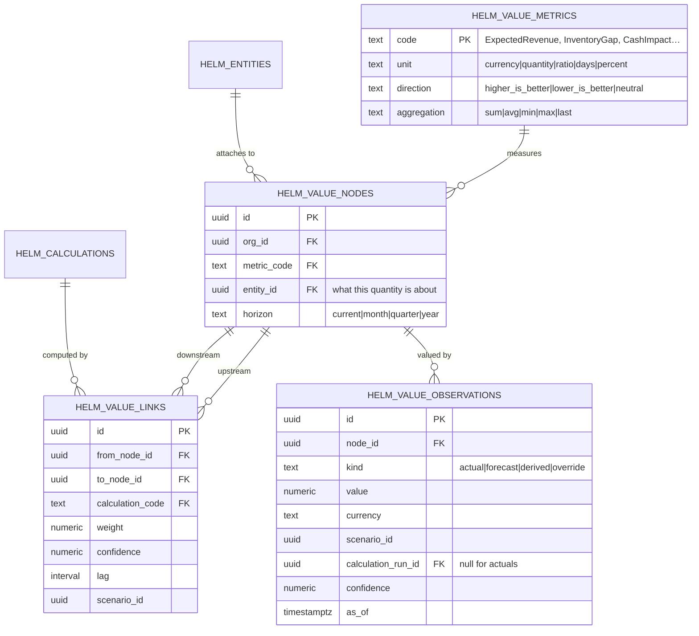
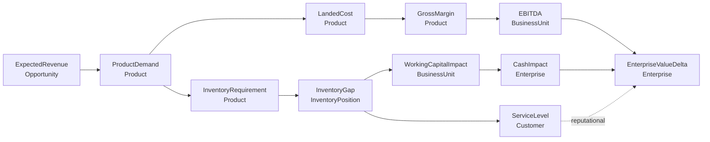
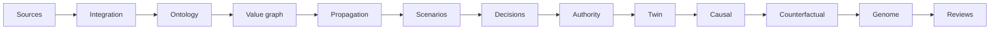

# Domain Model

The objects HELM reasons about, and the rules that bind them. The concrete type
taxonomy lives in [../domain/ontology.md](../domain/ontology.md); the traversal
and persistence contracts in [kernel-interfaces.md](kernel-interfaces.md).

## 1. Three tiers of model

HELM's model has three tiers, and confusing them is the most expensive mistake
available:

| Tier | Question | Example | Mutable by |
| --- | --- | --- | --- |
| **Semantic** | *What exists and how is it connected?* | "SKU-X is a Product sold through Distributor D into Segment Pharma" | connectors, managers |
| **Quantitative** | *What are the numbers, and how do they reach each other?* | "Expected revenue 2.94B → demand 12 units → inventory gap 8" | the propagation engine |
| **Managerial** | *What do we do, who decides, what happened?* | "Decision: expedite import. Approved by Country GM. Margin came in 2pts below expectation." | humans, under authority |

The semantic tier is the ontology. The quantitative tier is the value graph plus
propagation. The managerial tier is decisions, authority, outcomes and lessons —
and it is kept by the layers above the value graph (§4).

## 2. Semantic tier — the ontology core

Four tables carry the entire semantic model. Type taxonomies are **registry
rows, not enums** ([ADR-0006](../adr/0006-data-driven-ontology.md)).



Five properties of this design carry most of its value:

**Temporal validity.** `valid_from` / `valid_to` mean an entity is never
destroyed by an update — it is closed and superseded. "What did the graph look
like when that decision was made?" is a query, not an archaeology project. This
is what makes counterfactual analysis possible at all.

**Provenance.** `source_system` + `source_ref` + `observed_at` on every row.
The audit answer to "why this number?" bottoms out in a named system at a named
time, or in a named human.

**Confidence.** A forecast entity and an invoiced fact live in the same table
and are distinguishable. Propagation carries confidence forward, so a derived
number is never more certain than its weakest input.

**Scenario overlay.** `scenario_id` on relationships (and on the value
observations) means a scenario is a *sparse overlay* on reality, not a copy of
the graph. `scenario_id IS NULL` is the world as it is.

**Extensibility without migration.** Adding `ProductionLine` or
`supplied_under_contract` inserts registry rows. No DDL, no deploy, no enum
edit. This is §2.1's "do not hard-code every future entity" taken literally.

### 2.1 Entities reference, they do not duplicate

An ontology entity for SKU-X does **not** copy the inventory numbers. It carries
`source_system='helm'`, `source_ref='<helm_inventory_items.id>'` — or
`source_system='memoire'`, `source_ref='<opportunities.id>'` for an opportunity.

The graph is a **spine of meaning over rows that keep living in their own
tables** ([ADR-0007](../adr/0007-value-graph-projection.md)). This is the same
reference-plus-snapshot discipline already used for Memoire, applied internally.

Consequences: no sync problem, no double truth, and existing `helm_cost_objects`
/ `helm_inventory_items` / `helm_processes` tables keep working unchanged while
gaining a place in the value model.

## 3. Quantitative tier — the value graph

The value graph answers *how a change here becomes a change there*.



A **value node** is a metric about an entity over a horizon:
`(ExpectedRevenue, Opportunity#123, month)`. A **value link** says one node
feeds another *by a named calculation*. An **observation** is a value, tagged
with how it was obtained and under which scenario.

The canonical chain, expressed in this model:



Every arrow is a row with a calculation, a weight, a confidence and a lag —
inspectable and overridable per scenario.

### 3.1 Calculations are registered, never inline

```
helm_calculations(code, version, expression_kind, definition jsonb,
                  inputs[], output_metric, unit_check, owner, description)
```

A calculation declares its inputs and output metric, so the propagation engine
derives execution order from the registry rather than from hand-written call
sequences. `expression_kind` starts as `deterministic_formula` and is the
extension point for a stochastic implementation later
([ADR-0008](../adr/0008-deterministic-before-ai.md)) — identical contract, different
implementation. HELM never optimizes: it quantifies trade-offs; managers resolve them.

Every execution writes a `helm_calculation_runs` row plus per-node
`helm_calculation_trace` entries: inputs, formula version, output, confidence,
timestamp. **This is the table that answers "why 4.2B revenue at risk?"** and it
is why §17 auditability is a schema property rather than a UI feature.

## 4. Managerial tier

Above the value graph, each layer keeps its own records — all `helm_*`, all org-scoped
with RLS, and every one that is history is append-only with a database-stamped record
time. The full list of append-only tables is asserted in `verify:schema`.

| Family | Records (tables) | Layer reference |
| --- | --- | --- |
| Scenarios | scenarios, revisions, overrides, runs, constraint results | [scenario-runtime](layers/scenario-runtime.md) |
| Decisions | decisions, revisions, alternatives, criteria, assessments, assumptions, challenges, evidence, commitments, commitment snapshots, action intents (`helm_actions`), outcome reviews, decision events | [decision-runtime](layers/decision-runtime.md) |
| Authority | decision types, policies and rules (versioned), role occupancy, delegations, governance profiles, visibility grants, evaluations, required approvals, approval acts | [authority-runtime](layers/authority-runtime.md) |
| Twin | snapshots (five kinds, two-time lens), sensitivity clearances | [management-twin](layers/management-twin.md) |
| Causal | variables, claims, claim revisions, evidence, evidence links, correlation findings, questions and candidates | [causal-graph](layers/causal-graph.md) |
| Counterfactual | cases, worlds, reviews | [counterfactual-worlds](layers/counterfactual-worlds.md) |
| Genome | episodes and their references, patterns, revisions, evidence, lessons, lesson reviews | [management-genome](layers/management-genome.md) |
| Integration | sync ledger, dry-run write-back requests | [integration-fabric](layers/integration-fabric.md) |
| Reviews | reviews, items, closures | [management-reviews](layers/management-reviews.md) |
| AI | AI runs (the audit) | [intelligence-runtime](layers/intelligence-runtime.md) |

A decision holds no numbers of its own: an alternative references the scenario run that
computed its future, so "why did we choose this?" resolves through the rationale, the
criteria and the chosen future state down to a source fact.

The pre-kernel tables of the first application — signals, cost objects, economics rows,
inventory items, processes, approval rules — are **not used**. Attention is the twin's
rule-based conditions; margins, inventory and capacity are value nodes and governed
calculations; approval is the authority runtime. The tables remain in the shared database
(migrations are additive and never drop) and nothing reads them.

## 5. How the shapes reconcile

The first application was decision-centric; HELM is value-centric. They are two ends of
one chain, and the layers in between are what make the chain explain itself:



Two moves defined the restructure, and both are done:

1. **The engines became governed calculations.** What was an arithmetic function over
   hand-assembled silo inputs is a registered calculation over value nodes, executed in
   exact decimals with a trace. The pre-kernel engines themselves were then deleted.
2. **The learning loop closes through people, not by itself.** A failed assumption can be
   recorded as evidence against a causal claim, and the claim's status is *derived* from
   the evidence policy; an episode, a pattern and a lesson are authored and reviewed. No
   layer adjusts a link weight, a formula or an authority rule because of what it saw.

## 6. Invariants

1. An entity's canonical key is unique per `(org_id, type)` — ingestion is idempotent by
   construction.
2. A relationship's endpoints must satisfy its type's domain constraints.
3. History is closed, never deleted; statuses are derived at a lens, never stored.
4. A derived observation's confidence never exceeds the minimum of its inputs'.
5. Every derived observation references the calculation run that produced it. No orphan
   numbers.
6. `scenario_id IS NULL` is reality. A scenario never mutates reality.
7. Decision state changes only through the decision runtime, and every transition writes
   an append-only event.
8. Authority is a separate, immutable evaluation bound to the commitment fingerprint,
   written only by the trusted service; an approval comes from the caller, from a seat or
   delegation they held, and never from the committer when independence is required.
9. Objects that summarize others are read whole or not at all.
10. A source value and a model estimate of the same quantity sit side by side; neither
    overwrites the other.
11. The AI reads as the caller and writes nothing; an agent perspective is not decision
    authority; HELM writes to no source system.
