# HELM — Architecture

The one architecture document. It states what HELM is, the layers it is built
from, the distinctions it refuses to blur, how time, visibility and authority
work, how AI is governed, what is proven and what is not. Everything else under
`docs/` is either a *layer reference* (one layer in depth), an *ADR* (one
decision and its reasons), or *archive* (how the pre-kernel application worked,
kept only as history).

## 1. What HELM is

HELM is **enterprise management infrastructure**: the layer above operational
systems where an enterprise's management truth is kept — what is true, what is
modelled, what is being decided, who may decide it, what management believes
about why, what it has learned before, and how all of that looked at any moment
in the past.

It is not a dashboard, a BI tool, a workflow engine or a chatbot. It **never
recommends, ranks, scores a person, votes or predicts.** It shows evidence and
trade-offs, evaluates the criteria management stated, records the choice a person
made, and remembers.

Memoire (a separate product, one shared database) records commercial execution.
HELM reads it as a source and never writes it (§5, [helm-vs-memoire](helm-vs-memoire.md)).

## 2. The stack

```mermaid
flowchart TB
    SRC["Source systems<br/><i>Memoire · ERP · finance · SCM · HR</i>"]
    INT["integration-runtime<br/><small>adapters · identity · ingestion ledger · drift · dry-run writeback</small>"]
    ONT["ontology + graph-store<br/><small>entities · relationships · provenance · two-time</small>"]
    VG["value-graph<br/><small>metrics · nodes · links · typed observations</small>"]
    PROP["propagation-engine<br/><small>governed calculations · exact decimals · trace</small>"]
    SCN["scenario-runtime<br/><small>branches of the model · overrides · feasibility</small>"]
    DEC["decision-runtime<br/><small>question · alternatives · criteria · assumptions · commitment</small>"]
    AUTH["authority-runtime<br/><small>who may commit what · trusted verdicts</small>"]
    TWIN["twin-runtime<br/><small>management state at a lens · delta · trajectory</small>"]
    CAUS["causal-runtime<br/><small>evidence-backed beliefs about why</small>"]
    CF["counterfactual-runtime<br/><small>anchored what-might-have-been</small>"]
    GEN["genome-runtime<br/><small>episodes · patterns · lessons</small>"]
    REV["review-runtime<br/><small>weekly · monthly · quarterly · strategic</small>"]
    AI["intelligence-runtime<br/><small>governed, read-only, grounded</small>"]
    AG["agent-runtime<br/><small>council of perspectives</small>"]
    APP["Applications<br/><small>Country GM Cockpit · Reviews · instrument pages</small>"]

    SRC --> INT --> ONT --> VG --> PROP --> SCN --> DEC --> AUTH --> TWIN --> CAUS --> CF --> GEN --> REV --> AI --> AG --> APP
```



Each layer sits on the ones above it in this picture and **knows nothing of the
ones below**. `verify:boundaries` makes that executable: dependencies point one
way, each concept's words are confined to its home, and the permanent absences
(§12) hold in every package.

| Layer (package) | It owns | It refuses | ADR · reference |
| --- | --- | --- | --- |
| `shared` | ids, exact decimals, `Result`, injected clock | ambient time, floats for money | [0016](../adr/0016-decimal-arithmetic.md) |
| `ontology` · `graph-store` | entity and relationship types as registry data; bitemporal-lite graph behind a port; provenance as records | a copy of a source row | [0006](../adr/0006-data-driven-ontology.md), [0013](../adr/0013-provenance-as-first-class-records.md), [0014](../adr/0014-bitemporal-lite.md) · [layer](layers/ontology-and-graph-store.md) |
| `value-graph` | metrics with machine-readable semantics, value nodes, typed links, observations (`ACTUAL` `FORECAST` `TARGET` `ESTIMATE` `DERIVED` `SCENARIO`) | one enterprise-value score | [0015](../adr/0015-value-graph-specialized-storage.md) · [layer](layers/value-graph.md) |
| `propagation-engine` | governed calculations, dependency order, exact decimal execution, an append-only trace | a formula it cannot show | [0017](../adr/0017-calculation-semantics.md), [0018](../adr/0018-numerical-normalization.md) · [layer](layers/propagation-engine.md) |
| `scenario-runtime` | a scenario is a *branch of the model*: pinned fork point, sealed overrides, re-executed engine, feasibility, comparison | copying data; recommending a future | [0019](../adr/0019-scenario-runtime.md), [0020](../adr/0020-period-identity.md) · [layer](layers/scenario-runtime.md) |
| `decision-runtime` | the question, alternatives *bound to runs*, management's own criteria, owned assumptions, challenges, a fingerprinted commitment, outcome reviews | choosing; scoring; grading a decision by its outcome | [0021](../adr/0021-decision-runtime.md) · [layer](layers/decision-runtime.md) |
| `authority-runtime` | roles, delegation-of-authority policy versions, consequence-based rules, delegation, approval acts, decision visibility; the trusted verdict service | approving automatically; letting a client assert its own authority | [0022](../adr/0022-decision-authority-graph.md), [0024](../adr/0024-trusted-authority-runtime.md), [0025](../adr/0025-sensitivity-and-scenario-visibility.md) · [layer](layers/authority-runtime.md) |
| `twin-runtime` | management state **at a lens**: snapshots, delta, trajectory (current vs committed future), lineage, rule-based attention, sensitivity | one health score; an AI priority | [0023](../adr/0023-management-digital-twin.md) · [layer](layers/management-twin.md) |
| `causal-runtime` | scoped causal claims, an evidence hierarchy with ceilings, a *derived* status, reconstruction at any earlier lens; correlation kept apart | discovering causes; a path probability | [0026](../adr/0026-enterprise-causal-graph.md), [0027](../adr/0027-causal-evidence-policy.md) · [layer](layers/causal-graph.md) |
| `counterfactual-runtime` | cases anchored *before* a decision, worlds under `AS_KNOWN_THEN` and `WITH_HINDSIGHT`, four layers side by side, `NOT_ESTIMABLE` | regret; a single number; hindsight as the starting point | [0029](../adr/0029-counterfactual-worlds.md) · [layer](layers/counterfactual-worlds.md) |
| `genome-runtime` | episodes that wrap a decision *by reference*, patterns people author, lessons someone else reviews; similarity by named features | learning a pattern nobody proposed; rating a person | [0028](../adr/0028-management-genome.md) · [layer](layers/management-genome.md) |
| `integration-runtime` | `SourceAdapter`, identity by alias, an ingestion ledger with derived checkpoints, drift detection, **dry-run** writeback | double entry; guessing at a changed source; a live write | [0030](../adr/0030-integration-fabric.md) · [layer](layers/integration-fabric.md) |
| `review-runtime` | the management cadence: a review is a pack of *references*, closes with one disposition per item, carries forward by reference, reproduces | minutes, agendas, attendees; rewriting a closed review | [0031](../adr/0031-management-reviews.md) · [layer](layers/management-reviews.md) |
| `intelligence-runtime` | fifteen READ-ONLY governed tools, grounding, a provider port, an audit trail | writing anything; a recommendation; storing reasoning | [0032](../adr/0032-governed-intelligence-runtime.md) · [layer](layers/intelligence-runtime.md) |
| `agent-runtime` | a council of perspectives over one gathered truth | a vote, a consensus, a choice; speaking for people | [0033](../adr/0033-agent-council.md) · [layer](layers/agent-council.md) |

The integration fabric is *lateral*: it brings source truth in through the value
graph and reads decisions only to decide what may be proposed outward. Nothing
above it depends on it, and it depends on nothing above authority.

## 3. Distinctions the architecture will not blur

Each is a permanent invariant with a contract that fails when it is broken.

| Distinction | Where it is enforced |
| --- | --- |
| **Source Truth ≠ Model Truth** — a source actual and a model estimate sit side by side; neither overwrites the other | value-graph observation types; `verify:integration-runtime` |
| **Calculation dependency ≠ causal relationship ≠ correlation ≠ coincidence** | `verify:causal-vs-calculation`, `verify:causal-evidence` |
| **Scenario ≠ Counterfactual** — ex ante vs ex post; different anchors | `verify:counterfactual-runtime` |
| **AS_KNOWN_THEN ≠ WITH_HINDSIGHT** — a decision is not judged on information it could not have had | `verify:counterfactual-temporality` |
| **Decision Process Quality ≠ Outcome Quality** — HELM records both and grades neither | `verify:genome-process-outcome` |
| **AI interpretation ≠ enterprise truth** — the AI reads and comments; the audit is not a fact | `verify:intelligence-governed`, `verify:intelligence-grounding` |
| **Agent Perspective ≠ Decision Authority** — the council never votes, ranks or chooses | `verify:council` |
| **Visibility ≠ Authority** — seeing a decision confers no right to approve it | `verify:decision-visibility`, `verify:review-security` |
| **Expected ≠ Actual ≠ Committed future** — kept as layers, never averaged | `verify:twin-snapshot`, `verify:counterfactual-runtime` |

## 4. Time

Every record that describes the world carries two times: **effective** (when it
was true) and **recorded** (when HELM learned it), the latter **stamped by the
database**. A *lens* is a pair `(effectiveAsOf, recordedThrough)`; anything can be
read at any lens, and a later fact cannot change an earlier reading:

- a twin snapshot is reproducible at its lens;
- a causal claim was `HYPOTHESIS` on 19 January and `SUPPORTED` after the 20th, and
  the 19th still reads as it did;
- an episode is unknown before it was opened;
- a review closed on a day still reproduces byte-for-byte after a terrible outcome
  is recorded long afterwards;
- a counterfactual is anchored to a state recorded *before* the decision.

Statuses (claim status, pattern status, review `OPEN` / `CLOSED`, freshness) are
**derived** at a lens and never stored; the schema contracts fail if a table has a
`status`, `score`, `rating`, `verdict`, `rank`, `regret` or `winner` column.

## 5. Visibility, sensitivity and authority

- **Sensitivity classes**: `GENERAL_MANAGEMENT`, `FINANCIAL_SENSITIVE`,
  `COMMERCIAL_CONFIDENTIAL`, `HR_RESTRICTED`, `STRATEGIC_RESTRICTED`. A person holds
  clearances; a value carries the class its metric implies.
- **Read whole or not at all.** Objects that summarize others — an episode, a
  counterfactual case, a management review — carry every class of what they hold
  and are withheld whole from a viewer missing one; the response says how much was
  withheld, never how much it contained.
- **Decision visibility** follows units and grants; an item that rests on a decision
  the viewer cannot see is withheld from an object they *can* read.
- **Row-based policies.** RLS helpers are row-based so `INSERT … RETURNING` works;
  by-id wrappers are used only by *other* tables' policies. `verify:schema` forbids
  a policy that re-reads its own row by id.
- **Authority is computed where the client cannot reach.** Verdicts and approvals are
  produced by the trusted authority service (`helm-authority`, built and
  contract-tested, **not deployed** — [deployment gate](trusted-runtime-deployment-gate.md));
  client writes to the authority tables are revoked.
- **Append-only.** Records are inserted, never updated or deleted by the client; a
  guard trigger refuses `UPDATE` and `DELETE` and stamps the record time.
  `verify:schema` lists every append-only table.

## 6. Lineage: every number explains itself

A manager clicks any figure and sees source, formula, inputs, timestamp,
assumptions, confidence and upstream dependencies — down to the source-system
fact and the ingestion event that brought it (`verify:lineage`,
`verify:twin-lineage`, `verify:causal-lineage`, `verify:genome-lineage`,
`verify:decision-lineage`). An AI statement cites evidence ids that resolve to a
kernel object at a lens; a review item is a reference to the object itself.

## 7. The management loop

```text
source → truth → twin → scenarios → decision → authority → commitment
   ↑                                                            │
   └── source ← integration ← review ← genome ← causal ← outcome ┘
```

`verify:v1-loop` lives it once, end to end on the Meridian Vietnam demonstration
enterprise: the Rohto allocation issue appears (Review 1 opens with the twin
*before* the decision); management explores scenarios, decides, commits and is
governed; the outcome arrives; causal beliefs form and are challenged; an episode,
patterns and a counterfactual review are recorded; Review 2 inherits what Review 1
left open *by reference* and shows expected against actual without a verdict; then
a source system moves, HELM ingests it as source truth, the next review is prepared
with exactly that change since the last one closed, the AI briefs it from governed
evidence, the writeback stays a dry run — and no closed review, decision or
commitment was touched.

## 8. AI is governed, not trusted

The intelligence runtime gives a provider plain JSON evidence gathered by
READ-ONLY tools *as the caller*, and decides what survives of its answer
([ADR-0032](../adr/0032-governed-intelligence-runtime.md)): classed statements
grounded in cited evidence, fabricated figures removed, recommendations removed,
hypotheses kept as hypotheses, questions instead of suggestions, run-local
evidence ids. The audit table cannot hold a reasoning trace. The council
([ADR-0033](../adr/0033-agent-council.md)) gathers once, asks each instantiated
perspective about its own evidence subset, and shows disagreement as a fact about
the alternatives — with no vote, consensus, score or choice. A deterministic
reference provider runs everything today; a language-model adapter is the same
port, composed at the edge, and **has not been exercised**.

## 9. Persistence

Every stateful layer is written against a **port** with two implementations that
pass one conformance suite: an in-memory reference (what the demo, the tests and
the contracts run on) and a Postgres adapter behind `postgres.ts`, the only I/O
boundary. Migrations are additive, `helm_*` only, applied live through the
protocol *pre-flight → repo/live diff → named parts → post-flight → rolled-back
server proof (with a control) → advisors*, and the Memoire function fingerprint is
checked unchanged. The Postgres conformance suites cannot run without an isolated
authenticated environment and are **skipped, not passed** (§11).

## 10. Applications

Applications compose layers and hold presentation only.

| Route | Register | What it shows |
| --- | --- | --- |
| `/` Cockpit | management | *Now* beside the *committed future* — no health score; attention as named conditions with their causes; a governed AI brief; the council behind it, on demand |
| `/reviews` | management | the cadence, the pack for a review, closing with dispositions, reproduction |
| `/decisions`, `/decisions/:id` | management | the decision, its alternatives bound to runs, criteria, assumptions, challenges, governance, commitment; AI explanation |
| `/scenarios` | instrument | branches of the model, overrides, feasibility, comparison, lineage |
| `/twin` | instrument | snapshots at a lens, delta, trajectory, item lineage |
| `/governance` | instrument | authority in force, evaluations, delegation, approvals |
| `/causal`, `/genome`, `/counterfactuals` | instrument | claims and evidence; episodes, patterns, lessons; anchored worlds |
| `/sources` | instrument | connected systems, sync ledger, drift, quarantine, dry-run writeback |
| `/ontology`, `/value-graph`, `/calculations` | instrument | the semantic kernel, raw |

The UI rules are in [CLAUDE.md](../../CLAUDE.md) and the
[visual system](../product/visual-system.md). Every page reads the kernel through a
viewer's access — a reader picker on the instrument pages, the Country GM on the
Cockpit — never through the connection's.

## 11. Verification

`npm run check` = typecheck · lint · **890 tests** (877 pass, 13 skipped, 0 fail;
all skips are the Postgres conformance suites) · **70 contracts** (`verify:*`,
[ADR-0010](../adr/0010-test-and-contract-strategy.md)) ending in
`verify:boundaries` and `verify:docs`. `npm run test:mutations` deliberately breaks
the code — a pinned column, a removed guard, a widened policy, a recommendation
filter switched off — and fails if any contract still passes.
`node scripts/lib/bench-*.mjs` measures the in-memory layers (no Postgres numbers
are produced or guessed).

What is **not** proven:

- **Blocker A** — the trusted authority runtime is not deployed; the cloud
  Decision → Commitment → Authority Evaluation → Approval path is unproven.
- **Blocker B** — the Postgres conformance suites (13) have never run in an isolated,
  authenticated environment; RLS is proven by rolled-back proofs run as the database
  owner, not from authenticated clients.
- No language-model provider has been run; the reference provider proves the
  governance, not the quality.
- Only Memoire is a real source; ERP, finance, SCM and HR are contracts without
  adapters. No live write-back exists, by design.
- Performance is measured in memory only.

See [trusted-runtime-deployment-gate.md](trusted-runtime-deployment-gate.md),
[roadmap.md](roadmap.md) and the [V1 audit](v1-audit.md).

## 12. What HELM never does

It does not recommend, rank, score or average — not scenarios, decisions,
perspectives, patterns or reviews. It does not score, rate or rank a person, or
grade a decision by its outcome. It does not produce a single health score. It does
not predict an outcome, assign a path probability, discover a cause or mine a
pattern nobody proposed. It does not optimize. It does not approve, commit, escalate
or execute automatically — a person acts. It does not let an AI or an agent write
enterprise truth. It does not write to a source system live. It does not copy what a
source owns. These are asserted in `verify:boundaries` by name, in every package and
in the app's services and pages.
