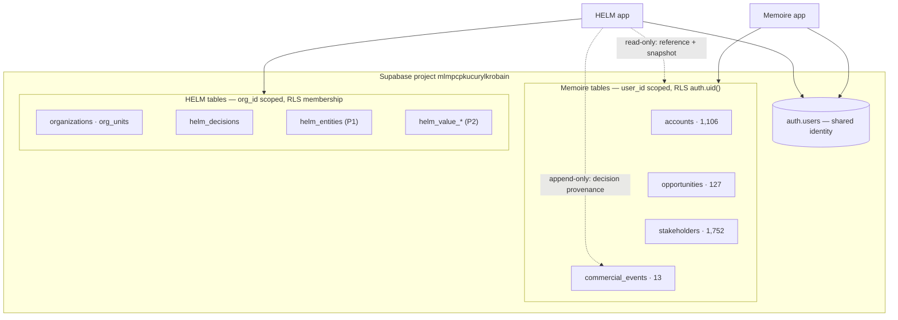

# HELM vs Memoire — The Boundary

**This separation is non-negotiable.** It is enforced by a contract test
(`verify:memoire-boundary`), not by memory or good intentions.

## 1. One sentence each

**Memoire is the Commercial Execution Platform.** Commercial people work in it,
all day. It produces **Commercial Truth**.

**HELM is the Enterprise Management Infrastructure.** Managers use it to decide.
It produces **Management Truth**.

> Memoire records what happened. HELM decides what to do about it.

## 2. Ownership table

| Capability | Owner | HELM may |
| --- | --- | --- |
| Accounts, contacts, stakeholders | **Memoire** | reference by id, snapshot |
| Opportunities, pipeline, stages | **Memoire** | reference, snapshot, project as entities |
| Quotations, tenders, orders | **Memoire** | reference |
| Activities, interactions, plans | **Memoire** | read aggregates |
| Competitor records, commercial knowledge | **Memoire** | read signals |
| Commercial forecast & calibration | **Memoire** | consume as input |
| — | — | — |
| Enterprise ontology & value graph | **HELM** | own |
| Cross-functional propagation | **HELM** | own |
| Scenarios & simulation | **HELM** | own |
| Decisions, options, assumptions | **HELM** | own |
| Decision authority & approval chains | **HELM** | own |
| Outcome ledger, lessons, genome | **HELM** | own |
| Management attention & signals | **HELM** | own |
| Enterprise state snapshots | **HELM** | own |

### 2.1 The rules that follow

1. **HELM never writes to Memoire.** No insert, upsert, update or delete on any
   Memoire-owned table, from anywhere (`verify:memoire-boundary`). HELM once appended
   a `commercial_events` row as decision provenance; that write is **retired** (§4.2).
2. **HELM never builds a commercial execution screen.** No account list, no
   pipeline board, no activity logger, no quotation editor.
3. **Memoire never imports HELM code**, and has no knowledge HELM exists beyond
   receiving events with a `helm://` source URL.
4. **HELM never copies a Memoire entity.** It stores a reference plus an
   immutable snapshot (§4.1).
5. **A migration never alters or drops a Memoire table.** Additive only, forever
   ([ADR-0003](../adr/0003-supabase-postgres-system-of-record.md)). The one statement
   HELM makes about a Memoire table is adding `opportunities` to the `supabase_realtime`
   publication, which changes nothing in the table
   ([ADR-0034](../adr/0034-memoire-live-sync.md)).

## 3. The shared substrate — and why that is not a boundary violation

HELM and Memoire share **one Supabase project** (`mlmpcpkucurylkrobain`):
one Postgres database, one auth system, one user identity.

This is a deliberate strategic choice, not an accident of convenience. It buys:

- **One identity.** A manager signs in once; no SSO federation to build.
- **Zero-latency integration.** No ETL, no sync lag, no reconciliation job.
- **Referential integrity across the boundary.** `memoire_opportunity_id` can be
  a real reference, not a hopeful string.

It costs discipline, paid in three ways: schema namespacing
([ADR-0005](../adr/0005-namespace-all-helm-tables.md)), strictly additive
migrations, and an **application-level** boundary that the database does not
enforce for us. Sharing a database is exactly why the boundary must be asserted
by tests — nothing physical stops a careless `select` on `accounts`.



### 3.1 Two different tenancy models in one database

| | Memoire | HELM |
| --- | --- | --- |
| Scope column | `user_id` | `org_id` |
| RLS predicate | `auth.uid() = user_id` | `is_org_member(org_id)` |
| Sharing | single-user workspaces | multi-user, role-ranked |

They coexist because they never share a table. The bridge between them is the
signed-in user: HELM reads Memoire data **as that user**, so RLS guarantees HELM
can never surface commercial data the user could not already see in Memoire. The
boundary is enforced by Postgres, in the user's own security context.

An implication worth stating plainly: HELM's org-level view of commercial data is
currently limited to what its *individual signed-in users* can see in Memoire. A
true org-wide commercial read requires Memoire to adopt the shared org layer —
already anticipated by its `scope` seam
([discovery-findings.md §6](../archive/discovery-findings.md#6-memoire--what-the-sibling-codebase-teaches)).
Until then, org-wide commercial aggregates come from the connector's event
stream, not from live cross-user queries.

## 4. The integration contract

### 4.1 Read: reference + immutable snapshot, never copy

When a decision draws on commercial context, HELM stores:

1. **The reference** — `memoire_opportunity_id`, `memoire_account_id`.
2. **An immutable snapshot** — `context_snapshot jsonb`: the fields the manager
   actually saw, at the moment of analysis.

Why both. The reference keeps HELM current: live data is re-read for display, and
Memoire keeps evolving without breaking HELM. The snapshot keeps HELM honest: a
decision must be judged against the information available when it was made. If
an opportunity later moves from 70% to 20%, the decision was not wrong — it was
made on 70%. Without the snapshot, every retrospective becomes hindsight bias,
and the genome learns the wrong lesson.

### 4.2 Write: none — a dry run

HELM does not write into Memoire. When a decision is committed and governance
permits it, the commitment carries **action intents** naming the system that will do
the work; for Memoire, the integration fabric turns an explicit intent into a
**dry-run write-back request**: the payload a live write *would* send, the
commitment fingerprint, an idempotency key, and a receipt that says `sent: false`
([ADR-0030](../adr/0030-integration-fabric.md)). The schema pins the mode to
`DRY_RUN`, and the adapter has no method that sends.

HELM does not update an opportunity's stage, value, probability or close date — even
when a decision implies one. It tells the manager what to change; the manager changes
it in Memoire. Anything else makes two systems authoritative for one field. A live
write-back would be a separate, explicitly authorized decision and a later migration.

### 4.3 Events: the contract and the transport

Today Memoire is read through the user's own RLS by the integration fabric's reader
(`createMemoireOpportunityReader`), rows strictly after a checkpoint. The contract a
source system follows is the `SourceAdapter` port
([kernel-interfaces §7](kernel-interfaces.md)); the event names below are the vocabulary
a publishing source would use:

```
account.updated              opportunity.created
opportunity.updated          opportunity.stage_changed
quotation.created            pipeline.changed
activity.completed           competitor.detected
tender.updated               commercial_signal.detected
```

Each event carries `{ eventType, occurredAt, sourceSystem, sourceRef, payload,
idempotencyKey }` and is translated by the connector into ontology entities,
relationships and observations. The kernel never sees Memoire's vocabulary.

Because HELM and Memoire share a database, "publish" can start as a polled
outbox read over existing tables — the contract matters more than the transport,
and adopting the contract first means the transport can change later without
touching the kernel.

The first transport is live ([ADR-0034](../adr/0034-memoire-live-sync.md)): a Supabase
Realtime notice that one of the reader's opportunities changed wakes HELM, which
re-reads through the reader above — the notice's payload is never applied — and
composes a new current state when something changed. Realtime enforces Memoire's own
RLS, so a reader hears only their own rows.

## 5. Failure modes to watch for

Signs the boundary is eroding, each one a reason to stop:

- A HELM screen a salesperson would want to use daily.
- A `helm_*` table with a column duplicating a Memoire field (`account_name`,
  `opportunity_stage`) rather than referencing it.
- HELM computing a commercial forecast instead of consuming Memoire's.
- Memoire importing anything from HELM.
- A `supabaseClient.from('accounts')` call inside a kernel package.
- HELM writing to any Memoire table at all.

The last two are mechanically detectable and are what `verify:memoire-boundary`
asserts.
