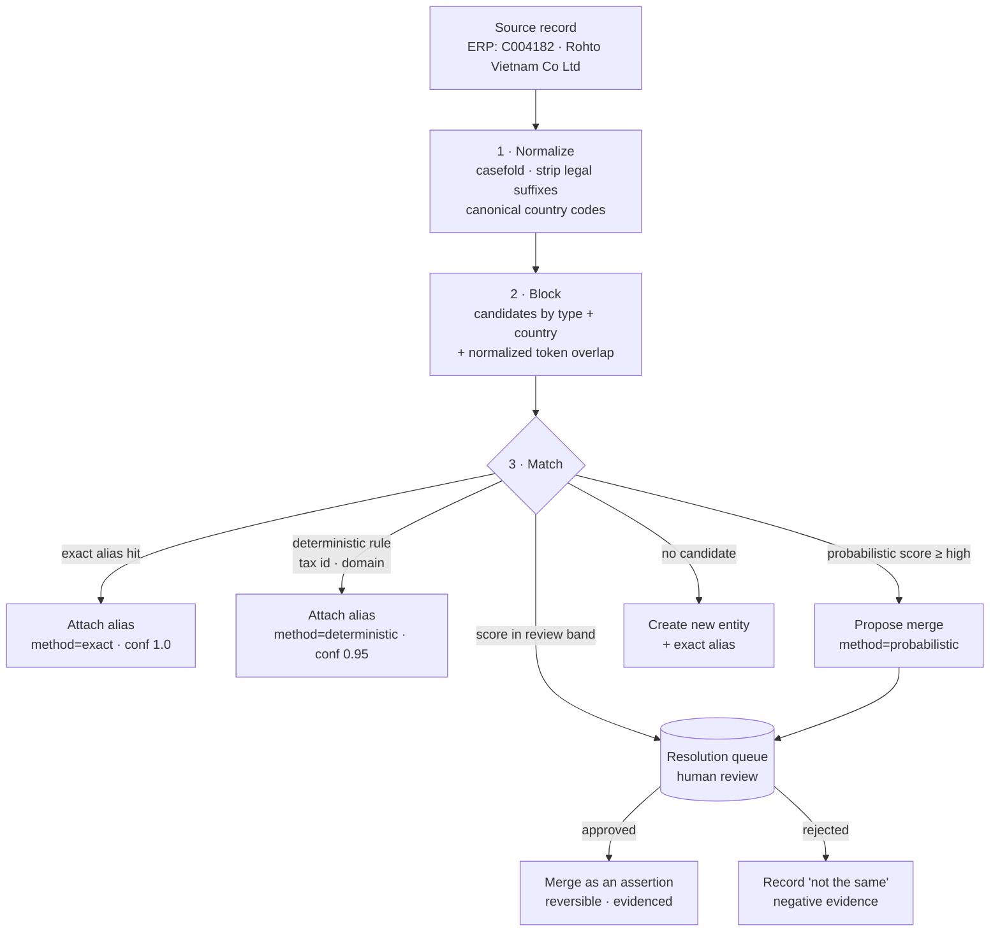

# Canonical Identity and Entity Resolution

Phase 1 does **not** solve enterprise entity resolution. It ensures the ontology
cannot structurally prevent it. This document records the target architecture and
what Phase 1 puts in place for it.

## 1. The problem

The same management entity is named differently by every system that touches it:

| System | Identifier | Value |
| --- | --- | --- |
| Memoire | account id | `a3f2…` / "Rohto Vietnam" |
| ERP | customer code | `C004182` |
| Finance | AR customer | `ROHTO-VN-001` |
| SCM | ship-to party | `VN-HCM-0042` |

HELM must eventually understand these may be one `Customer`. Until it does,
management truth fragments in exactly the way HELM exists to prevent: revenue
under one identifier, receivables under another, service history under a third,
and no way to see the customer whole.

Getting this wrong is expensive in both directions. **Under-merging** leaves the
enterprise unable to see a customer whole. **Over-merging** silently combines two
real customers, and every number downstream is wrong with no visible symptom —
which is why the design below treats a merge as a reversible, evidenced assertion
rather than a destructive edit.

## 2. Three identifiers, deliberately distinct

| Identifier | Scope | Stability | Purpose |
| --- | --- | --- | --- |
| `id` (uuid) | HELM internal | permanent | referential integrity; what relationships point at |
| `canonical_key` | unique per `(org, entity_type)` | stable, human-readable | the entity's semantic identity |
| **alias** | one per external identifier | as stable as its source | how a source system names this entity |

`canonical_key` format is `<namespace>:<kind>:<ref>`:

```
memoire:account:a3f2c1d4-…      an entity HELM first learned from Memoire
erp:customer:C004182            an entity HELM first learned from ERP
helm:customer:rohto-vietnam     a manager-created or resolved canonical entity
helm:inventory:SKU-X@WH-HCMC    a HELM-native composite
```

The namespace records **where this identity came from**, not where the truth
lives. An entity first ingested from Memoire keeps its `memoire:` canonical key
even after ERP aliases attach to it.

## 3. What Phase 1 builds: `helm_entity_aliases`

```sql
helm_entity_aliases(
  id, org_id,
  entity_id          -- the HELM entity this alias resolves to
  system             -- 'memoire' | 'erp' | 'finance' | 'scm' | 'hris' | 'manual'
  alias_kind         -- 'source_id' | 'code' | 'name' | 'tax_id' | 'email' | 'domain'
  alias_value        -- 'C004182'
  normalized_value   -- 'c004182' — casefolded/trimmed for matching
  match_method       -- 'exact' | 'manual' | 'deterministic' | 'probabilistic'
  confidence, evidence jsonb,
  valid_from, valid_to,
  created_by, created_at
)
```

Three properties make this the right shape:

**Many aliases, one entity.** Adding a system means adding alias rows, never
restructuring the entity.

**`match_method` records *how* we believe the link.** An `exact` source-id match
and a `probabilistic` name match are both aliases, but a manager reviewing a merge
needs to see which is which. A system that cannot distinguish them cannot be
audited.

**Aliases are temporal.** A customer code retired and reissued is
`valid_to`-closed, not deleted — so historical facts still resolve correctly.

Phase 1 writes `exact` aliases only, at ingestion: each entity gets an alias for
the source identifier it came from. This is the foundation, not the resolution.

## 4. The target resolution architecture (Phase 13+)



**Blocking before matching** is what keeps this tractable: comparing every
incoming record against every entity is quadratic. Blocking on type + country +
token overlap reduces candidates to a handful before any scoring runs.

**A review band, not a threshold.** Scores above the high bound auto-link; below
the low bound create a new entity; between them, a human decides. The band's
width is a tuning decision that trades review effort against error rate, and it
belongs to the organization, not to HELM.

**Negative evidence is recorded.** "These two are *not* the same" must persist, or
every re-ingestion re-proposes the same rejected merge and reviewers learn to
ignore the queue.

### Merging is an assertion, not a deletion

When two entities are found to be one:

- both entity rows **survive**; one is marked `merged_into` the other;
- aliases and relationships re-point to the survivor;
- the merge is a `helm_provenance` row with `method='inferred'` or
  `'human_assumption'`, its evidence, and its actor;
- **unmerge is supported** by reversing the assertion.

This follows the same discipline as
[ADR-0014](../adr/0014-bitemporal-lite.md): facts are superseded, never
destroyed. An irreversible merge on probabilistic evidence would be a data-loss
bug wearing a feature's clothes.

Memoire already has an `account_merges` table (17 rows), which is precedent worth
studying when this is built — and a reminder that the commercial system does its
own merging. **HELM must not fight it:** where Memoire has merged two accounts,
HELM's aliases should follow rather than re-derive.

## 5. What Phase 1 deliberately does not do

- No fuzzy matching, no scoring, no blocking implementation
- No resolution queue or review UI
- No merge/unmerge operations
- No cross-system reconciliation

Each of these needs a second real source to be validated against. Building them
against Memoire alone would produce a resolver tuned to one system's naming
conventions — confidently wrong in a way that only appears when ERP arrives.

## 6. The structural guarantees Phase 1 must hold

These are the properties that keep §4 reachable, and they are what the phase is
actually accountable for:

1. An entity's identity (`id`) is **independent of any source identifier**, so
   re-identification never breaks relationships.
2. External identifiers live in a **many-to-one** alias table, so a second system
   is additive.
3. `match_method` and `confidence` exist on every alias from the start, so links
   made today are distinguishable from links inferred later.
4. Aliases are **temporal**, so identifier reuse does not corrupt history.
5. Provenance is first-class ([ADR-0013](../adr/0013-provenance-as-first-class-records.md)),
   so a future merge has somewhere to record its evidence and its actor.
6. `canonical_key` is **namespaced**, so two systems' identifiers cannot collide
   before resolution has had a chance to run.
