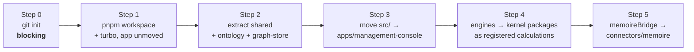

# Repository Structure

The proposed target layout, why it differs from the brief's sketch in three
places, and how the existing 32-file application gets there without a rewrite.

## 1. Target layout

```text
helm/
├── apps/
│   ├── management-console/        the operator surface (today's src/, migrated)
│   │   ├── src/{pages,components,services,lib}/
│   │   └── vite.config.ts
│   └── country-gm-demo/          Phase 14 reference application
│
├── packages/
│   ├── shared/                   ids · money · temporal · Result · errors · Clock
│   ├── ontology/                 entity/relationship registry, validation, provenance
│   ├── graph-store/              GraphStore port + postgres & in-memory adapters
│   ├── value-graph/              metrics · nodes · links · observations · impact paths
│   ├── propagation-engine/       calculation registry · dependency order · trace
│   ├── scenario-engine/          scenarios · overrides · results · comparison
│   ├── decision-engine/          lifecycle · options · assumptions · outcomes
│   ├── authority-engine/         decision rights · chains · escalation
│   ├── digital-twin/             enterprise state · snapshot versioning
│   ├── causal-engine/            hypotheses · evidence · confidence
│   ├── management-genome/        situation/decision/outcome patterns · lessons
│   ├── counterfactual-engine/    actual vs expected vs alternative
│   ├── agent-runtime/            agents · debate workflow · LlmProvider port
│   ├── connector-sdk/            SourceConnector contract · event envelope
│   └── ui/                       design primitives (presentation only)
│
├── connectors/
│   ├── memoire/                  real: shares the database
│   ├── erp-mock/
│   ├── finance-mock/
│   └── scm-mock/
│
├── services/
│   └── worker/                   scheduled propagation, ingestion (Phase 3+)
│
├── supabase/migrations/          additive SQL, chronological
├── scripts/                      verify:* architecture contracts
├── docs/{product,architecture,domain,adr,api}/
├── pnpm-workspace.yaml
└── turbo.json
```

## 2. Three deliberate departures from the brief's sketch

The brief (§13) invites improvement where technically justified. Three changes,
each with an ADR:

### 2.1 No `services/api` yet

The brief lists `services/api` (Fastify or NestJS). HELM's data layer is already
Postgres with RLS, reached through Supabase's generated API — which means an HTTP
layer today would be a proxy that *re-implements* the authorization RLS already
enforces, in a weaker place.

`services/worker` ships when Phase 3 needs scheduled propagation.
`services/api` ships when a genuine server-only need arrives, and
[ADR-0003](../adr/0003-supabase-postgres-system-of-record.md) names the four
triggers explicitly so the decision is not left to drift.

### 2.2 `graph-store` is a first-class package, not an internal detail

The brief says "build a graph abstraction layer" (§10). Making it a *package*
with two adapters shipped from day one — Postgres and in-memory — is what proves
the abstraction rather than asserting it. Kernel packages become testable without
a database, and the demo organization runs entirely offline.

### 2.3 `digital-twin` holds state, not a second model

The brief lists `digital-twin` alongside the graph packages. To avoid two
competing enterprise models, the twin is defined narrowly: **versioned snapshots
and state projections over the ontology and value graph**, never its own parallel
representation. See [ADR-0011](../adr/0011-reconcile-decision-and-value-models.md).

## 3. Package rules

1. **Dependencies point inward.** `apps` → `packages` → `shared`. Never reverse.
2. **Kernel packages are pure.** No React, Vite, Supabase, HTTP, filesystem, or
   ambient clock. The one exception is `graph-store`'s Postgres adapter, which is
   the designated I/O boundary.
3. **No kernel package imports a connector.** Connectors depend on
   `connector-sdk` and `ontology`; nothing depends on a connector.
4. **No connector imports another connector.**
5. **`ui` is presentation only.** No formulas, thresholds, or state transitions.
6. **Each package owns its tests**, and they run without a database.
7. **Every package has an explicit public surface** via its `exports` field. Deep
   imports into another package's internals are a build error.

All seven are asserted by `verify:package-boundaries`, which reads each
`package.json` and walks the import graph. An architecture rule that is not
executable is a suggestion.

## 4. Tooling

| Concern | Choice | Why |
| --- | --- | --- |
| Package manager | **pnpm workspaces** (10.30.3 present) | strict node_modules surfaces undeclared dependencies — a real boundary guard, not just disk savings |
| Task orchestration | **Turborepo** | caches per-package build/test/lint; `turbo run test --filter=...` gives fast package-level feedback |
| Language | **TypeScript 6**, strict | already in use, `erasableSyntaxOnly` |
| Test runner | **Vitest** in packages | brief's preference; monorepo-aware, one runner everywhere |
| Contracts | **`verify:*` node scripts** | Memoire's proven practice ([ADR-0010](../adr/0010-test-and-contract-strategy.md)) |
| Frontend | React 19 + Vite 8 + Tailwind | unchanged |
| Database | Postgres via Supabase | unchanged ([ADR-0003](../adr/0003-supabase-postgres-system-of-record.md)) |

### 4.1 On the existing test runner

The 40 existing tests use `node:test` + `node:assert/strict`, importing `.ts`
directly. Migration to Vitest is an import swap
(`from 'node:test'` → `from 'vitest'`); `node:assert/strict` keeps working, so
assertions are untouched. This happens per package as engines move, never as a
big-bang rewrite, and the suite must stay green at every step.

## 5. Migration path — five reversible steps

The existing app is green (40 tests, clean build, clean lint). It stays green
throughout; **no step leaves the repository broken.**



**Step 0 — version control. Blocking.** No restructuring of an unversioned
7,300-line codebase. `git init`, `.gitignore` already correct, one baseline
commit.

**Step 1 — workspace, nothing moved.** Add `pnpm-workspace.yaml`, `turbo.json`,
root scripts. The app keeps building from `src/`. Verifies the toolchain in
isolation.

**Step 2 — new packages first.** `shared`, `ontology`, `graph-store` are *new
code* with no existing consumers, so they carry zero regression risk. This is
Phase 1's real work, and it is why Phase 1 comes before any move.

**Step 3 — move the app.** `src/` → `apps/management-console/src/`. Mechanical:
paths and configs. Green suite is the gate.

**Step 4 — engines become calculations.** One engine at a time, each wrapped as a
registered `Calculation` with its tests moving alongside. The eight existing
engines are pure functions already; this is packaging, not rewriting.

**Step 5 — connector extraction.** `services/memoireBridge.ts` becomes
`connectors/memoire` implementing `SourceConnector`, with `translate()` as a pure,
fixture-tested function.

Steps 0–2 are Phase 1. Steps 3–5 land across Phases 2–3 and 13.

## 6. What Phase 0 changed on disk

Documentation, and nothing else:

```
docs/architecture.md  →  docs/architecture/implemented-mvp.md   (moved)
docs/product/vision.md · backlog-phase-1.md                     (new)
docs/architecture/{system-overview,domain-model,helm-vs-memoire,
                   data-flow,security-model,roadmap,
                   kernel-interfaces,repository-structure,
                   discovery-findings}.md                       (new)
docs/domain/{ontology,canonical-scenario}.md                    (new)
docs/adr/{README,0001…0011}.md                                  (new)
```

No source file was modified, no dependency added, no migration written. Phase 0
is a decision, and a decision that reorganises a codebase before it is approved
is exactly what [ADR-0001](../adr/0001-record-architecture-decisions.md) exists
to prevent.
