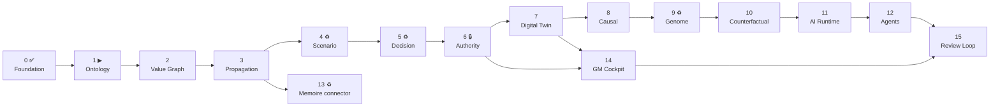

# Implementation Roadmap

Sixteen phases, in order, with what already exists credited and the gates that
make each phase complete. Status as of **2026-09-19** (Phase 0 delivered).

## 1. Sequencing principle

**Build the kernel before the surfaces.** Propagation needs a value graph; a
value graph needs an ontology. Skipping to the cockpit produces charts over
disconnected silos — which is what HELM exists not to be.

Concretely: the existing build already has working scenario, decision and
outcome machinery (Phases 4, 5 and part of 9) **but no foundation underneath**.
So the roadmap does not run 1→15 linearly; it builds 1–3 to put a floor under
what exists, then returns to 4–6 to reconnect them.

✅ done · ▶ next · ♻ partially exists, needs reconnection · 🔒 gates the cockpit

## 2. Phase table

| # | Phase | Status | Exists today | Gate |
| --- | --- | --- | --- | --- |
| 0 | Architecture Foundation | **✅ done** | — | docs + 11 ADRs + backlog |
| 1 | Enterprise Ontology | **▶ next** | nothing | registry + graph-store (2 adapters) + traversal + explorer |
| 2 | Value Graph | planned | nothing | canonical chain queryable end to end |
| 3 | Propagation Engine | planned | 8 pure engines to wrap | `explain()` reaches source facts for every number |
| 4 | Scenario Engine | ♻ reconnect | `engines/scenario.ts`, `helm_scenarios`, tornado | scenarios become graph overrides |
| 5 | Decision Engine | ♻ reconnect | full lifecycle, alternatives, assumptions, audit | options carry scenario ids; lines become overrides |
| 6 | Authority Graph | 🔒 redesign | amount-threshold rules only | multi-dimensional rules + chain + escalation + unit RLS |
| 7 | Digital Twin | planned | nothing | versioned snapshots; current / scenario / expected-future |
| 8 | Causal Graph | planned | nothing | hypotheses with evidence both ways; correlation kept distinct |
| 9 | Management Genome | ♻ extend | `engines/decisionMemory.ts` patterns | structured `find_similar_*`, not embeddings-only |
| 10 | Counterfactual | planned | nothing | actual vs expected vs alternative with confidence |
| 11 | AI Intelligence Runtime | planned | none by design | provider port; citation validation rejects ungrounded ids |
| 12 | Multi-Agent | planned | nothing | 6 function agents + debate → synthesis |
| 13 | Memoire Connector | ♻ formalize | working bridge, no contract | `SourceConnector` + pure `translate()` + fixtures |
| 14 | Country GM Cockpit | **blocked on 6, 7** | signal inbox | attention-first; every card traces to kernel objects |
| 15 | Management Review Loop | planned | nothing | W/M/Q reviews generated from the model |

## 3. Phase 1 — Enterprise Ontology (next)

**Objective.** A semantic spine: entities and relationships that are org-scoped,
temporal, provenance-bearing, confidence-carrying and extensible without a
migration.

**Deliverables.** `packages/shared`, `packages/ontology`, `packages/graph-store`
(Postgres + in-memory), migration `helm_entity_types` / `helm_relationship_types`
/ `helm_entities` / `helm_relationships` + RLS, seed ontology from
[ontology.md](../domain/ontology.md), traversal with temporal and scenario
filters, a read-only ontology explorer in the console, and the first three
`verify:*` contracts.

**Gate.** Both adapters pass one shared suite · a Memoire opportunity projects
into an `Opportunity` entity with provenance · traversal answers "what does this
opportunity touch?" to depth 4 · re-running ingestion changes nothing · `asOf`
returns the historical graph · unit and integration tests green · typecheck and
lint clean · docs updated.

Full task breakdown: [../product/backlog-phase-1.md](../product/backlog-phase-1.md).

## 4. Phases 2–3 — the value spine

**Phase 2** adds value metrics, nodes, links and observations, and makes the
canonical chain — Opportunity → Revenue → Demand → Inventory → Working Capital →
Margin → Cash → Enterprise Value — a real traversable structure with a visual
explorer. Gate: the chain resolves end to end for the demo org and every edge
shows its calculation, weight and confidence.

**Phase 3** is the pivot from "a management app" to "management infrastructure".
The calculation registry, dependency ordering, execution and the calculation
audit log arrive; the eight existing engines become registered calculations.

Gate for Phase 3, stated as the product promise: **a manager clicks any number
and sees source, formula, inputs, timestamp, assumptions, confidence and upstream
dependencies, all the way down to a source-system fact.** No number in HELM may
exist without that chain.

## 5. Phases 4–6 — reconnect governance

4 and 5 exist and work; their job here is to stop being self-contained. Scenario
variants become sparse graph overrides; decision alternatives stop being
free-typed financial lines and become overrides whose consequences are computed.

**Phase 6 is a security phase.** Authority gains scope, geography, BU, risk,
action type, approval chain and escalation; unit-level and functional RLS land
with it ([security-model.md §3](security-model.md#3-known-gaps-and-the-phase-that-closes-each)).
It gates Phase 14: a cockpit exists to present cross-functional data to a scoped
role, so shipping it while any org member can read every country's margins would
be a defect, not a feature.

## 6. Phases 7–10 — state, causality, learning

7 gives versioned enterprise state, so "current vs scenario vs expected future"
is a comparison of snapshots. 8 separates correlation from management causal
hypothesis, with evidence for *and against* and a confidence that moves. 9 turns
the existing pattern detection into retrieval over structured situation patterns.
10 delivers counterfactuals as scenario comparison, behind an interface that
causal inference can implement later.

## 7. Phases 11–13 — intelligence and integration

AI enters **only after** the kernel can ground it. The gate is mechanical: a
response citing an id absent from its `GroundedContext` is rejected by the
runtime. Agents represent management functions and receive scope-narrowed
context. Phase 13 formalises the Memoire bridge into the connector contract that
ERP, Finance and SCM will reuse — and can run earlier, since it only needs
Phase 3.

## 8. Phases 14–15 — the applications

The cockpit opens on *what requires management attention*, not a wall of charts.
Each card traces to kernel objects, and clicking one opens context → why it
matters → value-chain impact → root causes → options → scenario comparison →
similar past decisions → recommendation → authority requirements → decision
action → outcome tracking.

Phase 15 generates weekly, monthly and quarterly reviews from the model: what
changed, why, where value moved, which decisions worked, which assumptions were
wrong, what needs escalation, what happens next.

## 9. Definition of done (every phase, from §19)

1. Relevant existing code inspected
2. Architecture docs written or updated
3. Domain model defined
4. Interfaces defined
5. Migration created (additive)
6. Domain logic implemented
7. APIs implemented
8. Minimal UI only if required
9. Demo data seeded
10. Unit tests written
11. Integration tests written
12. Tests run and green
13. Lint and typecheck clean
14. What was built documented
15. Remaining technical debt named

A phase is **not** complete if tests fail, typecheck fails, business logic is
untested, domain logic lives in React components, or an architectural assumption
is undocumented. Foundational changes need an ADR first
([ADR-0001](../adr/0001-record-architecture-decisions.md)).

## 10. Standing risks

| Risk | Mitigation |
| --- | --- |
| **No version control** | `git init` blocks Phase 1 step 1 |
| Shared production database | additive migrations, `verify:additive-migrations` |
| `helm_*` reshaping window closes at first real onboarding | do Phases 1–3 schema work now, while all `helm_*` tables are empty |
| Cockpit pressure before Phase 6 | phase gate documented here and in the security model |
| Ontology over-modelling | seed only what the canonical scenario needs; types are data, so additions are cheap |
| Propagation performance on deep graphs | `maxDepth` required on every traversal; measure before optimising |
| AI drift into ungrounded answers | citation validation is a rejection, not a warning |
