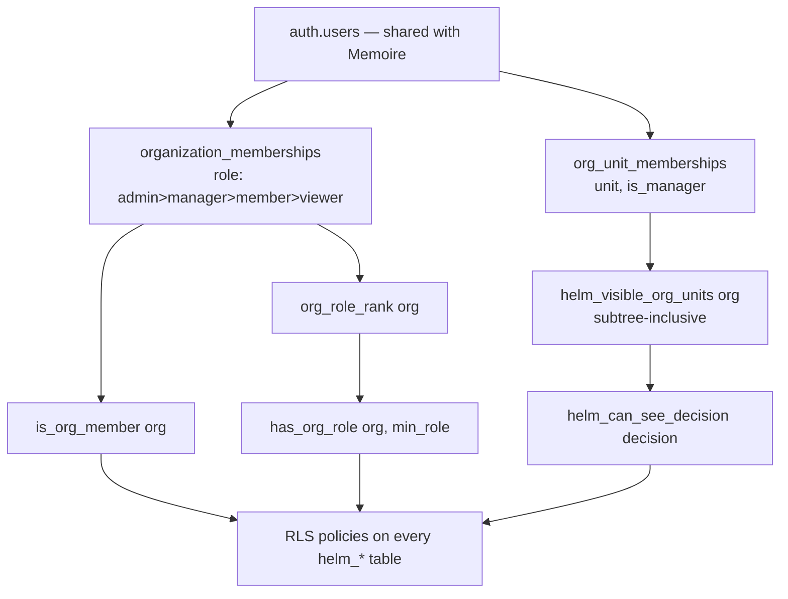

# Security Model

HELM holds an enterprise's most sensitive management information: margins by
customer, decision rationale, authority limits, risks, and outcomes that reflect
on named people. **No manager may be assumed entitled to every dataset.**

## 1. Principles

1. **Isolation in the data layer.** The tenant wall is Postgres RLS, not
   application code. A compromised or buggy client cannot cross it.
2. **Deny by default.** No policy means no access. New tables are unreachable
   until a policy grants reach.
3. **Least visibility.** Scope narrows by org, then unit, then function, then
   role, then sensitivity class.
4. **Authority ≠ visibility.** Seeing a decision and being able to approve it are
   separate checks with separate rules.
5. **History is immutable.** Audit trails have no UPDATE or DELETE policy.
6. **AI inherits, never widens.** An agent's context is built from its principal's
   scope. An agent cannot see what its principal cannot.

## 2. Implemented today



- Every HELM table carries `org_id`.
- Policies call `SECURITY DEFINER` helpers (`is_org_member`, `has_org_role`,
  `org_role_rank`) so membership lookups never recurse through the membership
  table's own policies. Helper `EXECUTE` is revoked from `anon`.
- Roles are **ranked**, and policies compare ranks — a new role slots in without
  a policy rewrite.
- Write requires `member`+; delete and governance writes require `manager`+;
  structural change requires `admin`.
- `helm_decision_events` has INSERT and SELECT policies only. The **absence** of
  UPDATE and DELETE is the guarantee.
- Org creation goes through a `SECURITY DEFINER` RPC so the creator becomes admin
  atomically, avoiding the chicken-and-egg of inserting the first membership into
  an org you are not yet a member of.

### 2.1 Cross-boundary reads are safe by construction

HELM reads Memoire data **as the signed-in user**. Memoire's RLS
(`auth.uid() = user_id`) therefore applies unchanged: HELM cannot surface
commercial data the user could not already see in Memoire. No service-role key
is used in the browser, and none is used to bypass a policy.

## 3. Known gaps and the phase that closes each

Stated plainly, because an undocumented gap is the dangerous kind.

| Gap | Impact today | Closes in |
| --- | --- | --- |
| ~~No unit-level RLS on decisions.~~ **Closed in Phase 6** for every decision table: a decision is readable by org admins, its creator, and members of a unit it is shared with or of any unit above it (`helm_can_see_decision`, subtree-inclusive over `org_unit_memberships`). Proven server-side with users in two BUs and a country GM. | — | ✅ Phase 6 |
| ~~Scenarios, value graph and calculations are still org-visible.~~ **Closed in Phase 7** ([ADR-0025](../adr/0025-sensitivity-and-scenario-visibility.md)): a scenario bound to a decision is captured by it; runs, values and steps follow the scenario and their class. Proven server-side. | — | ✅ Phase 7 |
| **Functional visibility is by unit only.** A function is modelled as an org unit (`department`) and a cross-functional decision gets one grant per unit; there is no per-field or per-metric function rule. | Coarse, but not over-broad for decisions | Phase 7 |
| ~~No sensitivity classes.~~ **Closed in Phase 7**: five compartments on metrics and value nodes, admin-granted time-bounded clearances, per-item enforcement in RLS and in the twin, withheld items stated. HR classes are reserved; no HR data exists. | — | ✅ Phase 7 |
| ~~There is no authority model.~~ **Closed in Phase 6** ([ADR-0022](../adr/0022-decision-authority-graph.md)): role occupancy, versioned DOA policies, consequence-based rules, delegation, evaluations bound to the commitment fingerprint, approval acts tied to identity and seat. `helm_approval_rules` is RETIRED. | — | ✅ Phase 6 |
| ~~Authority verdicts are computed in the client.~~ **Closed in Phase 7** ([ADR-0024](../adr/0024-trusted-authority-runtime.md)): only the trusted service writes evaluations, requirements and approval acts; it refuses client-supplied facts and re-derives the consequences' calculation trace. | — | ✅ Phase 7 (kernel and schema) |
| **The trusted service is not deployed.** The `helm-authority` edge function is built but not deployed; client writes are revoked, so the cloud decision page cannot record a verdict until it is. | Cloud governance flow unavailable | **pilot blocker** — [deployment gate](trusted-runtime-deployment-gate.md) |
| **SECURITY DEFINER helpers in `public`.** ~~Phase 6's three helpers were callable over RPC.~~ Moved to `helm_private` in Phase 7, `EXECUTE` revoked from `PUBLIC` and `anon`. The five shared-core helpers remain in `public` (Memoire's). | shared-core helpers only | ✅ Phase 7 for HELM's |
| **Field-level redaction is per twin item only.** Twin items and value observations are redacted by class; decision rows are still row-shaped. | Cannot share a decision while hiding its amount | later |
| **No AI access controls.** Nothing to control — there is no AI. Must exist before Phase 11. | none yet | Phase 11 |

**Phases 6 and 7 are therefore security phases as much as governance and state phases.** The
Country GM Cockpit (Phase 14) must not ship before it, because a cockpit's whole
purpose is presenting cross-functional data to a scoped role.

## 4. Target model

### 4.1 Five-dimensional scope

```ts
type Scope = {
  orgId: OrgId;              // hard tenant wall — RLS
  actorId: UserId;
  role: OrgRole;             // admin > manager > member > viewer
  orgUnitIds: OrgUnitId[];   // unit subtree visibility — RLS (P6)
  functions: string[];       // functional visibility — RLS (P6)
};
```

Resolved once per session, server-side, and passed into every kernel call. There
is no ambient tenant and no client-supplied scope.

Unit visibility is **subtree-inclusive**: membership of a `Region` grants its
countries. Computed by recursive CTE in a `SECURITY DEFINER` helper
(`visible_org_units(org_id)`), so policies stay single-expression and cheap.

### 4.2 Sensitivity classes

Every entity type and value metric carries a class:

| Class | Example | Visible to |
| --- | --- | --- |
| `operational` | inventory position, capacity | any member |
| `commercial` | customer margin, opportunity value | commercial + management in scope |
| `financial` | BU EBITDA, working capital | finance + management in scope |
| `strategic` | M&A scenario, market exit | admin + named roles |
| `personal` | compensation, performance | HR + named roles only |

Enforced at the graph-store adapter, so a traversal cannot leak a node the actor
may not see — even through a path they are otherwise allowed to walk. Filtering
in the UI would be theatre.

**As implemented in Phase 7** ([ADR-0025](../adr/0025-sensitivity-and-scenario-visibility.md)):
the classes are `GENERAL_MANAGEMENT`, `FINANCIAL_SENSITIVE`,
`COMMERCIAL_CONFIDENTIAL`, `HR_RESTRICTED`, `STRATEGIC_RESTRICTED`, held as
compartments (not levels) on value metrics and nodes, enforced in RLS on
observations, calculation steps and twin items (`helm_private.has_clearance`),
and in the twin's projection, which states what was withheld. Entity-type
classes are not yet modelled.

### 4.3 Authority as data

```
helm_authority_rules(
  id, org_id, action_type, decision_type,
  scope_org_unit_id, scope_country_entity_id, scope_function,
  amount_min, amount_max, currency,
  risk_max, required_role_entity_id,
  approval_chain_role_ids[], escalation_role_ids[],
  valid_from, valid_to, active
)
```

`AuthorityEngine.evaluate()` returns the rule that matched **and the rationale**,
so "you cannot approve this" is always accompanied by "because", "who can", and
"what the escalation path is". An authority denial with no explanation is a
usability defect and a support cost.

Rules are versioned by validity window: a decision approved last year is judged
against the authority that existed then.

### 4.4 Defence in depth for approvals

The authority check will run in **two independent layers**:

1. An `AuthorityEngine` consulted by the Decision Runtime before a commitment is
   recorded, producing a rationale, a chain and an escalation path.
2. An RLS policy on `helm_decision_commitments` restricting the INSERT to actors
   satisfying the matched rule.

Duplication is deliberate. Layer 1 can be bypassed by a direct API call; layer 2
cannot be bypassed at all.

**Superseded by ADR-0022.** Phase 6 keeps the commitment as history and does
not refuse its INSERT: refusing it would destroy the record of an unauthorized
act. Instead the authority evaluation is a separate, immutable record, and the
database's own guards check what can be checked without re-running the kernel —
the evaluated fingerprint is the commitment's, the actor is its committer, an
`AUTHORIZED` basis is a rule the actor held at the act, and an approval comes
from the caller, from a seat or delegation they held, never from the committer
when independence is required.

## 5. AI access controls (must precede Phase 11)

1. **Context is kernel-assembled.** An agent never queries the database; it
   receives a `GroundedContext` built under its principal's scope.
2. **Agents are scope-narrowed.** A Finance Agent receives `financial` and
   `operational` classes; it does not receive `personal`.
3. **Citations are validated.** A response referencing an id absent from its
   context is rejected, not flagged.
4. **No egress of sensitive classes** to an external model provider without
   explicit org-level configuration, recorded per organization.
5. **Every AI call is logged** with purpose, principal, scope, provider, model,
   and the context id set — so "what did the model see?" is answerable after the
   fact.

## 6. Operational security

- No service-role key in any client bundle. Browser code uses the anon key; RLS
  does the work.
- Secrets via environment only; `.env` is gitignored (`.env.example` is the
  template).
- Demo mode is fully in-memory and **never** writes to the cloud — the same rule
  Memoire enforces with `verify:sample-live-separation`.
- Migrations are additive; no migration alters or drops a Memoire table.

## 7. Contract tests

| Script | Asserts |
| --- | --- |
| `verify:rls-coverage` | every `helm_*` table has RLS enabled and ≥1 policy per needed operation |
| `verify:append-only` | `helm_decision_events` (and later audit tables) have no UPDATE/DELETE policy |
| `verify:org-scope` | every `helm_*` table has `org_id` and every policy predicate references it |
| `verify:no-service-key` | no service-role key reachable from client code |
| `verify:additive-migrations` | no migration contains `DROP`/`ALTER` against a Memoire table |
| `verify:memoire-boundary` | no kernel package reads a Memoire table; no write beyond `commercial_events` append |
| `verify:demo-isolation` | demo mode performs no network write |
