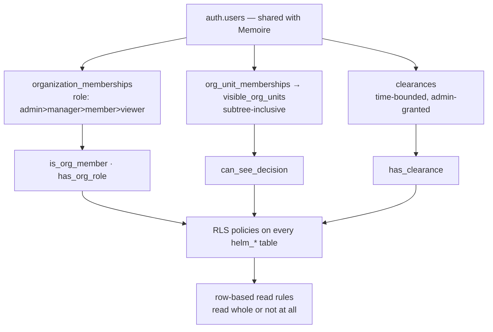

# Security Model

HELM holds an enterprise's most sensitive management information: margins by
customer, decision rationale, authority limits, risks, and outcomes that reflect
on named people. **No manager may be assumed entitled to every dataset.**

## 1. Principles

1. **Isolation in the data layer.** The tenant wall is Postgres RLS, not
   application code. A compromised or buggy client cannot cross it.
2. **Deny by default.** No policy means no access. New tables are unreachable
   until a policy grants reach.
3. **Least visibility.** Scope narrows by org, then unit, then decision, then
   sensitivity class.
4. **Visibility ≠ authority.** Seeing a decision and being able to approve it are
   separate checks with separate rules.
5. **History is immutable.** Records are inserted, never updated or deleted by a
   client; a guard trigger refuses both and the database stamps the record time.
6. **AI inherits, never widens.** The AI reads as the person asking. It cannot see
   what they cannot, and it cannot write.
7. **Summaries are read whole.** An object that summarizes others carries every
   class and unit of what it holds and is withheld whole from a viewer who lacks one.

## 2. Mechanisms

- **Tenant.** Every HELM table carries `org_id`; policies call `SECURITY DEFINER`
  helpers so membership lookups never recurse through the membership table's own
  policies. Roles are ranked (`admin > manager > member > viewer`); write needs
  `member`+, governance writes `manager`+, structure `admin`.
- **Private helpers.** HELM's helpers live in `helm_private`; `EXECUTE` is revoked
  from `PUBLIC` and `anon` ([ADR-0025](../adr/0025-sensitivity-and-scenario-visibility.md)).
  The five shared-core helpers in `public` are Memoire's.
- **Units.** Unit visibility is subtree-inclusive: membership of a region grants its
  countries.
- **Decisions.** A decision is readable by admins, its creator, and members of a unit
  it is shared with or of any unit above ([ADR-0022](../adr/0022-decision-authority-graph.md)).
  A scenario bound to a decision is captured by it; runs, values and steps follow the
  scenario and their class.
- **Sensitivity.** Five compartments — `GENERAL_MANAGEMENT`, `FINANCIAL_SENSITIVE`,
  `COMMERCIAL_CONFIDENTIAL`, `HR_RESTRICTED`, `STRATEGIC_RESTRICTED` — held on value
  metrics and nodes, granted to people as time-bounded clearances, enforced in RLS
  (`helm_private.has_clearance`) and in each layer's projection, which **states what
  was withheld**. HR classes are reserved; no HR data exists.
- **Read whole.** A causal claim (its unit audience, its variables' and evidence's
  classes, every decision it rests on), a genome episode, a counterfactual case and a
  management review are read only by someone who can read all of it. A genome pattern
  or lesson only when every episode it rests on is readable. A review item that rests
  on a decision the viewer cannot see is withheld from a review they can read.
- **Row-based policies.** Read policies are written over the row's own columns, so
  `INSERT … RETURNING` works; the by-id wrappers are used only by *other* tables'
  policies. `verify:schema` forbids a policy that re-reads its own row by id (the
  defect that once made the twin unable to save a snapshot and members unable to
  create decisions).
- **Append-only.** `verify:schema` lists every append-only table (history, audit,
  decision records, causal, genome, counterfactual, integration, review and AI-run
  tables): none permits DELETE or UPDATE to a client, `authenticated` holds only
  SELECT and INSERT, and a BEFORE guard refuses the rest and stamps `recorded_at`.
- **Authority is computed where the client cannot reach** ([ADR-0024](../adr/0024-trusted-authority-runtime.md)):
  only the trusted service writes evaluations, requirements and approval acts; it
  refuses client-supplied facts and re-derives the consequences' calculation trace.
  Client writes to those tables are revoked.
- **Cross-boundary reads are safe by construction.** HELM reads Memoire *as the
  signed-in user*: Memoire's RLS applies unchanged, no service-role key is used in the
  browser and none bypasses a policy. HELM never writes a Memoire object.

## 3. AI and agents

The AI reads as the caller ([ADR-0032](../adr/0032-governed-intelligence-runtime.md),
[ADR-0033](../adr/0033-agent-council.md)):

1. **Context is kernel-assembled.** The AI never queries the database; it calls a
   catalogue of `READ_ONLY` tools that use each layer's own projection for the caller.
2. **The provider is handed plain JSON** — no function, runtime, store or client.
3. **Citations are validated.** Evidence ids are run-local; a statement citing anything
   else is downgraded, and a figure no cited evidence returned is removed.
4. **Nothing widens.** A caller below a clearance or without decision visibility is
   handed less, and told so.
5. **Every run is audited** — asker, template and version, prompt hash, provider
   identity, tool calls, evidence references, grounding report — with no place to keep
   a reasoning trace. A person reads their own runs; an admin reads all.
6. **Agents are perspectives**, not principals: each is handed a subset of the *caller's*
   evidence and none can act.

## 4. Known gaps

Stated plainly, because an undocumented gap is the dangerous kind.

| Gap | Impact | Status |
| --- | --- | --- |
| **The trusted authority service is not deployed.** `helm-authority` is built and contract-tested; client writes are revoked, so the cloud decision page cannot record a verdict until it is. | cloud governance flow unavailable | **pilot blocker A** — [deployment gate](trusted-runtime-deployment-gate.md) |
| **Postgres conformance suites have never run in an isolated, authenticated environment** (13 suites). RLS is proven by rolled-back server-side proofs run as the database owner, each with a control, not from authenticated clients. | cloud persistence unproven | **pilot blocker B** |
| **No egress policy for an external model provider.** No such provider exists; the reference provider makes no network call. A real one must not receive a sensitive class without per-organization configuration, and that control does not exist yet. | none today | must exist before a language-model provider is connected |
| **Functional visibility is by unit only.** A function is an org unit (`department`); a cross-functional decision gets one grant per unit. | coarse, not over-broad | backlog |
| **Field-level redaction is per twin item only.** Decision rows are row-shaped. | cannot share a decision while hiding its amount | backlog |
| **Entity-type classes are not modelled**; classes live on metrics and nodes. | an entity's existence is not class-gated | backlog |
| **No rate or cost limits on AI runs.** | none with the reference provider | before a real provider |

Closed (each with a live server-side proof): unit-level decision visibility; scenario
and value visibility; sensitivity classes; the authority model; client-computed
verdicts; public `SECURITY DEFINER` helpers; causal, genome, counterfactual and review
leakage of restricted decisions, classes or units; policies that re-read their own row.

## 5. Operational security

- No service-role key in any client bundle. Browser code uses the anon key; RLS does
  the work.
- Secrets via environment only; `.env` is gitignored (`.env.example` is the template).
- Demo mode is fully in-memory and **never** writes to the cloud.
- Migrations are additive and `helm_*` only; none alters or drops a Memoire object, and
  the Memoire function fingerprint is checked unchanged after every live migration.
- Live migrations follow the protocol: pre-flight → repo/live diff → named parts →
  post-flight → rolled-back server proof with a control → advisors. No fixtures are left.

## 6. Contracts

| Script | Asserts |
| --- | --- |
| `verify:schema` | RLS on every `helm_*` table with a policy per needed operation; org-scoped policies; append-only tables permit no DELETE; no policy re-reads its own row; no destructive migration |
| `verify:*-schema` (value, scenario, decision, authority, twin, causal, genome, counterfactual, integration, review, intelligence) | each layer's tables: append-only, database record time, no stored status or score, pinned modes, read-whole helpers |
| `verify:*-security` (decision-visibility, twin, causal, genome, counterfactual, review) | who may read what, by unit, class and decision; visibility is not authority |
| `verify:authority-server` | the trusted service exists, refuses client facts and re-derives the trace |
| `verify:intelligence-governed`, `verify:council` | READ_ONLY catalogue, reads as the caller, plain-JSON provider, no write, no vote |
| `verify:memoire-boundary` | no kernel package touches a Memoire table; the app reads Memoire only through the bridge; no migration touches a Memoire object |
| `verify:boundaries` | dependencies point one way; concepts confined to their homes; no AI or agent write; eval-free; additive migrations |
| `verify:architecture` | apps → packages → shared; kernel purity (no I/O, ambient clock or randomness) |
