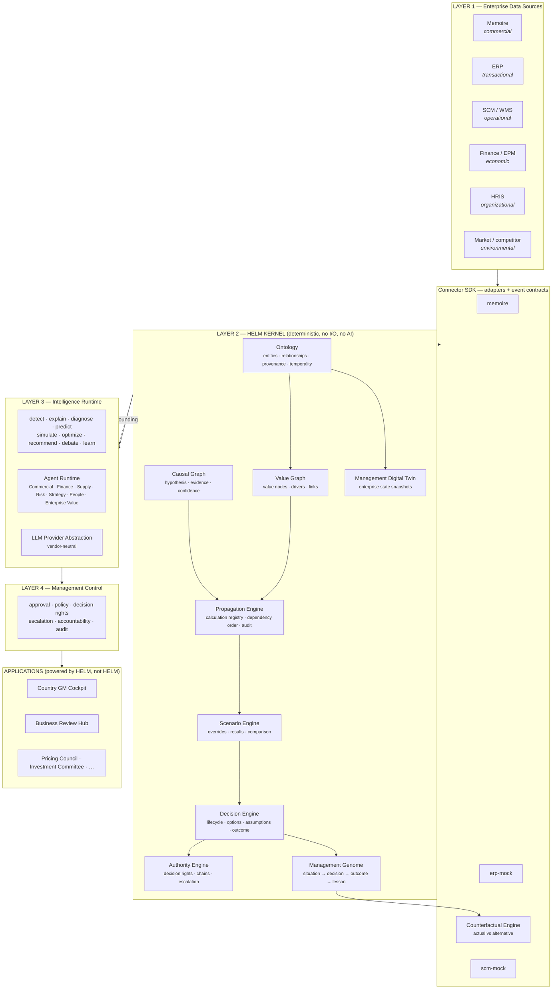

# System Overview

How HELM is layered, what each layer owns, and the rules that keep the layering
real. Companion documents: [domain-model.md](domain-model.md) (the objects),
[kernel-interfaces.md](kernel-interfaces.md) (the contracts),
[data-flow.md](data-flow.md) (how information moves),
[repository-structure.md](repository-structure.md) (where code lives).

## 1. The four layers

## 2. Layer 1 — Enterprise Data Sources

External systems of record. HELM owns none of them.

The kernel never names a source system. Every source reaches the kernel through
a **connector** implementing `SourceConnector`
([kernel-interfaces.md §7](kernel-interfaces.md#7-connector-sdk)), which
translates that system's vocabulary into ontology entities, relationships and
observations, stamped with provenance.

Rules:

- **No kernel package may import a connector.** Dependency points inward only.
- **No connector may import another connector.**
- Memoire is the first real connector. ERP, Finance and SCM ship as mock
  connectors behind the identical interface, so the kernel cannot tell the
  difference and the seam is proven before a real integration exists.

## 3. Layer 2 — The HELM Kernel

The most important part of the system, and the part the roadmap protects. Every
kernel package is pure TypeScript: no I/O, no framework, no network, no LLM,
no `Date.now()` without an injected clock. Persistence is reached only through
the `GraphStore` port ([ADR-0004](../adr/0004-graph-abstraction-layer.md)).

| Package | Owns | Phase |
| --- | --- | --- |
| `ontology` | Entity/relationship type registry, provenance, temporal validity, confidence | 1 |
| `value-graph` | Value metrics, nodes, drivers, links, impact paths | 2 |
| `propagation-engine` | Calculation registry, dependency ordering, execution, calculation audit log | 3 |
| `scenario-engine` | Scenarios, variables, overrides, results, comparison | 4 |
| `decision-engine` | Decision lifecycle, options, criteria, assumptions, evidence, outcomes | 5 |
| `authority-engine` | Authority rules, scope matching, approval chains, escalation | 6 |
| `digital-twin` | Enterprise/BU/commercial/supply/finance/resource/risk state + snapshot versioning | 7 |
| `causal-engine` | Causal hypotheses, evidence for and against, confidence, validity windows | 8 |
| `management-genome` | Situation/decision/outcome patterns, `find_similar_*`, lessons | 9 |
| `counterfactual-engine` | Actual vs expected vs alternative, deltas, confidence | 10 |
| `graph-store` | The `GraphStore` port + Postgres and in-memory adapters | 1 |
| `shared` | Ids, money, currency, temporal types, `Result`, error taxonomy, clock | 1 |

**Why this ordering is not negotiable:** propagation needs a value graph; a
value graph needs an ontology. Scenarios override a propagation; decisions
compare scenarios; authority gates decisions; the genome learns from decided
outcomes; counterfactuals compare against what the genome recorded. Building
downward from the UI produces a dashboard with a database behind it — which is
what the brief exists to prevent.

### 2.1 The one thing the kernel must get right first

An entity in HELM is not a copy of a row in a source system. It is a **node in
the value model that references** a row, carrying provenance, a validity window
and a confidence. This is what makes the same infrastructure able to represent
a live ERP fact, a manager's assumption, and a scenario override — and to tell
the three apart. See [ADR-0007](../adr/0007-value-graph-projection.md).

## 4. Layer 3 — Intelligence Runtime

Operates **on** kernel context; never in place of it.

The nine capabilities (detect, explain, diagnose, predict, simulate, optimize,
recommend, debate, learn) are progressively implemented. The first three are
deterministic and already partly exist as the signal rule engine.

Hard constraints:

- **Grounding is mandatory.** An AI capability receives a kernel context object
  and may reference only what is in it. No free-form recall of business facts.
- **Every AI output carries** data used, assumptions, reasoning summary,
  uncertainty, affected entities, expected value impact, risks, provenance.
- **Provider-neutral.** All model access goes through an `LlmProvider` port.
  No vendor SDK appears outside its adapter.
- **A hallucinated business fact is a defect of the same severity as a wrong
  number**, and contract tests treat it that way.

Agents (Phase 12) represent **management functions, not personalities**. Each
receives only the context its function is entitled to see — the same scope rules
that gate a human ([security-model.md](security-model.md)).

## 5. Layer 4 — Management Control

Governance is a layer, not a feature toggle. It owns human approval, policy,
decision rights, escalation, accountability and auditability.

The invariant: **a decision above its authority threshold cannot reach
`approved` without a qualified approver's recorded act.** This is enforced in
the decision-engine state machine *and* in Postgres RLS — two independent
layers, because a client is never trusted.

## 6. Applications

Applications are consumers, not the product. They may hold layout, interaction
and presentation. They may not hold business logic, formulas, thresholds or
state transitions — those live in kernel packages and are verified there.

The first reference application is the **Country GM Cockpit** (Phase 14), built
only once Phases 1–7 give it something real to show.

## 7. Cross-cutting invariants

Each is asserted by a `verify:*` contract script
([ADR-0010](../adr/0010-test-and-contract-strategy.md)):

1. **Dependency direction** — applications → kernel → shared. Never the
   reverse. No kernel package imports React, Vite, Supabase or a connector.
2. **Purity** — kernel packages perform no I/O and read no ambient clock.
3. **Determinism before AI** — no kernel package imports an LLM client.
4. **Explainability** — every produced number carries a calculation trace;
   every signal carries rule code, threshold, measurement and evidence.
5. **Auditability** — every state transition writes an append-only event.
6. **Isolation** — every org-scoped table carries `org_id` and RLS policies
   that consult membership; the tenant wall is in Postgres, not the client.
7. **Additive migrations** — no migration alters or drops a Memoire table.
8. **Versioned schemas** — ontology and calculation definitions are versioned;
   a stored result records the version that produced it.
