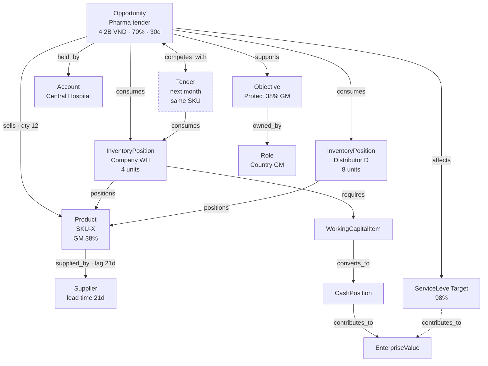

# The Canonical Management Scenario

The single scenario that proves HELM is more than a dashboard. It is the
acceptance test for the kernel: when it runs end to end with every number
traceable, Phases 1–6 are real.

Demo domain: **Meridian Life Sciences Vietnam** — a fictional multinational
pharma / laboratory / industrial-technology distributor. No confidential
real-world data. The existing demo organization
(`src/data/demoOrg.ts`) already stages this company and is extended, not
replaced.

## 1. The situation

A major pharma opportunity is expected to close.

**Memoire reports:**

| Field | Value |
| --- | --- |
| Opportunity value | 4.2B VND |
| Probability | 70% |
| Expected close | 30 days |
| Product | SKU-X |
| Quantity | 12 units |

**HELM knows, from elsewhere:**

| Fact | Value | Source |
| --- | --- | --- |
| Company inventory | 4 units | SCM |
| Distributor inventory | 8 units | SCM / partner |
| Incoming supply lead time | 21 days | Supplier |
| Current gross margin | 38% | Finance |
| Expedited freight | reduces GM | Finance |
| Another tender next month | needs the same SKU | Memoire |

No single source system can see this situation. That is the entire point: it is
not a commercial problem, an inventory problem or a finance problem. It is a
*management* problem, and it exists only in the joins.

## 2. What HELM must be able to say

The management question is not "do we have stock?" It is:

> If we commit to this deal, what do we give up — and is that trade worth making?

Answering it requires four things no operational system has: the value chain from
opportunity to enterprise value, the contention between this deal and next month's
tender, the cost of foreclosing a future option, and the authority to decide.

## 3. The situation as a graph



The `competes_with` edge, plus two `consumes` edges into the same company
position, is what makes the trade-off visible. Remove it and HELM becomes an
inventory calculator that always says yes.

## 4. Propagation

```
ExpectedRevenue        = 4.2B × 0.70               = 2.94B VND    conf 0.70
ProductDemand          = sells edge weight          = 12 units     conf 0.70
InventoryRequirement   = ProductDemand              = 12 units     conf 0.70
AvailableInventory     = company 4 + inbound 0      = 4 units      conf 1.00
                         (within 30d; supply lands day 21 — inside the window,
                          so inbound counts only under option A's lag override)
InventoryGap           = 12 − 4                     = 8 units      conf 0.70
WorkingCapitalImpact   = 8 × unit cost                             conf 0.70
GrossMargin            = revenue − landed cost      → 38% baseline  conf 0.70
ServiceLevelImpact     = f(gap, promised date)                      conf 0.60
FutureOpportunityRisk  = value at risk on the competing tender      conf 0.50
EnterpriseValueDelta   = roll-up of cash + margin + service         conf 0.50
```

Confidence degrades along the chain and never recovers. `EnterpriseValueDelta` at
0.50 is an honest statement: this is a 50%-confidence estimate built on a
70%-confidence opportunity and a 50%-confidence judgement about a competing deal.
A system that reported it at 0.70 would be lying by omission.

## 5. Management options

Each is a set of sparse graph overrides, not a separate model.

| Option | Overrides |
| --- | --- |
| **A — Expedite import** | `supplied_by.lag` 21d → 7d · `LandedCost` +freight premium |
| **B — Reallocate distributor stock** | `AvailableInventory` +8 · `FutureOpportunityRisk` ↑ on the competing tender |
| **C — Alternative product** | `sells` → SKU-Y · margin and service deltas |
| **D — Delay delivery** | `ServiceLevelImpact` ↓ · opportunity probability ↓ |
| **E — Combination (A + B)** | union of A and B overrides |

## 6. The comparison the manager sees

Every option reports the same metrics, because each ran the same propagation:

| | A Expedite | B Distributor | C Alt product | D Delay | E Combined |
| --- | --- | --- | --- | --- | --- |
| Revenue | full | full | reduced | at risk | full |
| Gross margin | ↓ freight | baseline | ↓ mix | baseline | ↓ partial |
| Working capital | ↑ | neutral | ↑ | neutral | ↑ |
| Service level | met | met | partial | **missed** | met |
| Inventory risk | ↑ expiry | ↓ | ↑ SKU-Y | neutral | moderate |
| Future opportunity risk | low | **high** | low | low | moderate |
| Cash impact | ↓ near-term | neutral | ↓ | neutral | ↓ |
| Strategic alignment | protects GM objective | risks next tender | dilutes portfolio | risks relationship | balanced |
| Confidence | 0.65 | 0.55 | 0.50 | 0.60 | 0.55 |

Two things are notable, and both are why this is not a dashboard:

**B looks best on the numbers and carries the highest strategic risk.** Only the
`competes_with` edge surfaces that. A margin-and-cash comparison would recommend B
without qualification.

**Every cell is traceable.** Each is a value observation with a
`calculation_run_id`, reachable back to a source fact.

## 7. Governance, outcome, learning

**Decision.** The manager chooses. HELM records the decision, its owner, the
chosen option, the actions, and the **expected outcome — before approval**.

**Authority.** `AuthorityEngine.evaluate()` checks action type, amount, org unit,
country and risk against the actor's role. If insufficient, HELM names the
required role, the approval chain and the escalation path. A denial always comes
with a reason.

**Execution.** Actions get owners and dates. One `commercial_events` row is
appended to Memoire with `helm://decision/<id>` provenance.

**Outcome.** Actual is recorded and compared with expected. Each assumption is
marked `held` or `failed`.

**Counterfactual.** "We chose A. Under B, estimated margin +1.2pts and the next
tender's risk 40% higher." Phase 10, as scenario comparison.

**Lesson.** Recorded, linked to the outcome, and surfaced on the next similar
decision — but only once three closed decisions agree two-to-one
(`decisionMemory.ts` already enforces this). One outcome is an anecdote.

## 8. Acceptance criteria

The scenario passes when a manager can, in the demo organization:

1. See a signal that the opportunity creates an inventory gap — with rule code,
   threshold, measurement and evidence.
2. Open it and see the value chain from opportunity to enterprise value.
3. Click any number and reach its formula, inputs, sources, timestamps,
   assumptions and confidence.
4. See that next month's tender contends for the same stock, and why.
5. Compare all five options on one screen, with identical metrics.
6. See similar past decisions and their lessons.
7. Be told who may approve it, and if not them, the chain and escalation path.
8. Record the decision with its expected outcome before approval.
9. Return later, record the actual, and mark each assumption held or failed.
10. See the resulting lesson affect the next similar decision.

Steps 1–5 require Phases 1–4. Step 6 requires 9. Step 7 requires 6. Steps 8–10
already work in the existing build.

**Nothing on any of those screens may be narrated by a model.** Every number is a
stored row with a trace.
