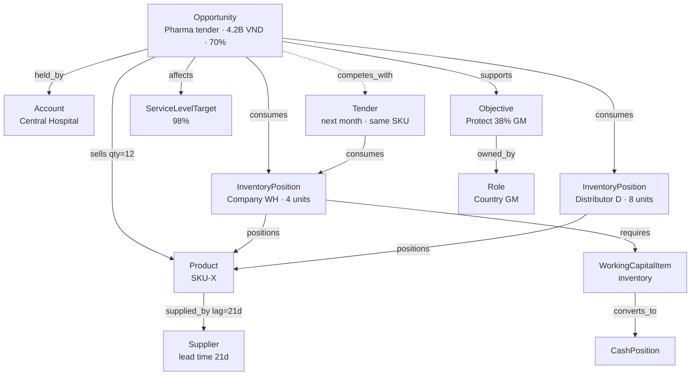

# Initial Enterprise Value Ontology

The seed semantic model: entity types, relationship types and value metrics that
ship as registry rows in Phase 1. Structure and storage are in
[../architecture/domain-model.md](../architecture/domain-model.md).

**This is a seed, not a ceiling.** Types are data
([ADR-0006](../adr/0006-data-driven-ontology.md)); an enterprise adds its own
without a migration. What ships here is the minimum that can express the
canonical scenario ([canonical-scenario.md](canonical-scenario.md)) end to end
and still generalise.

## 1. Design rules

1. **A type earns its place by connecting to value.** If no relationship path
   leads from it to `EnterpriseValue`, it is reference data, not an entity type.
2. **Types are nouns; relationships are verbs.** If a concept only exists as a
   link between two things, it is a relationship type.
3. **Single inheritance via `parent_code`.** `Account` specialises `Customer`,
   so rules written for `Customer` apply to accounts. Kept shallow.
4. **No source-system vocabulary.** Not `SapMaterial`, not
   `MemoireOpportunity` — `Product`, `Opportunity`. Source mapping belongs in
   connectors.
5. **Management concepts are first-class entities.** `Objective`, `Risk`,
   `Assumption`, `Decision` and `Lesson` are nodes in the same graph as
   `Product`. This is what lets HELM connect an inventory decision to a
   strategic objective and to a prior lesson.

## 2. Entity types

### 2.1 Domain: `organization`

| Code | Meaning | Key attributes |
| --- | --- | --- |
| `Enterprise` | The whole group; root of every hierarchy | `baseCurrency`, `fiscalYearStartMonth` |
| `Region` | Multi-country grouping | `regionCode` |
| `Country` | Legal/geographic operating unit | `iso2`, `currency` |
| `BusinessUnit` | P&L-bearing unit | `plOwnerRoleId` |
| `Function` | Commercial, Supply Chain, Finance, Service, Operations | `functionCode` |
| `Team` | Operating team inside a function | — |
| `Role` | A position with authority, independent of the person in it | `title`, `level` |
| `Person` | A named individual | `email`, `startDate` |

`Role` being separate from `Person` is deliberate: authority attaches to the
role, so a manager changing seats does not silently move decision rights, and
history stays interpretable.

### 2.2 Domain: `commercial`

| Code | Meaning | Key attributes |
| --- | --- | --- |
| `Market` | Addressable market | `sizeEstimate` |
| `Segment` | Customer segment (Pharma, Laboratory, Industrial) | `segmentCode` |
| `Customer` | Buying organization | `tier` |
| `Account` ⊂ `Customer` | Customer as managed in Memoire | `memoireAccountId` |
| `Distributor` ⊂ `Customer` | Channel partner holding stock | `holdsConsignment` |
| `Opportunity` | Identified revenue event | `value`, `probability`, `expectedCloseDate`, `memoireOpportunityId` |
| `Tender` ⊂ `Opportunity` | Formal competitive bid | `submissionDeadline`, `bidBond` |
| `Product` | Sellable item | `sku`, `listPrice`, `standardCost`, `shelfLifeDays` |
| `Portfolio` | Managed product grouping | — |
| `Channel` | Route to market | `channelCode` |
| `Competitor` | Rival in a market or deal | — |

### 2.3 Domain: `operations`

| Code | Meaning | Key attributes |
| --- | --- | --- |
| `Supplier` | Upstream source | `leadTimeDays`, `reliabilityScore` |
| `Warehouse` | Physical stock location | `locationCode` |
| `InventoryPosition` | Stock of a product at a location — the unit inventory decisions act on | `stockOnHand`, `stockInbound`, `expiryDate` |
| `CapacityPool` | Constrained resource (service engineers, QC, cold-chain) | `availableMinutesPerWeek`, `resourceCount` |
| `ProductionLine` | Manufacturing capacity | `throughputPerHour` |
| `Shipment` | In-transit consignment | `etaDate`, `mode` |
| `ServiceLevelTarget` | Promised service standard | `targetPct`, `penaltyClause` |

`InventoryPosition` rather than a bare `Inventory` because ownership and location
are exactly what the canonical scenario turns on: four units in the company
warehouse and eight at a distributor are different assets with different
availability.

### 2.4 Domain: `finance`

| Code | Meaning | Key attributes |
| --- | --- | --- |
| `RevenueStream` | Recurring revenue source | — |
| `CostPool` | Grouped cost with a behaviour | `behaviour: variable\|traceable_fixed\|allocated_fixed` |
| `OpexItem` | Operating expense line | `annualAmount` |
| `CapexItem` | Capital expenditure | `amount`, `usefulLifeYears` |
| `WorkingCapitalItem` | Inventory / receivable / payable position | `kind`, `daysOutstanding` |
| `CashPosition` | Cash at a point in time | `balance` |
| `Investment` | Committed capital with a return expectation | `hurdleRate` |

`CostPool.behaviour` is load-bearing: it is what lets the relevant-cost engine
mechanically decide relevance instead of asking a manager to classify each line
by hand.

### 2.5 Domain: `management`

| Code | Meaning | Key attributes |
| --- | --- | --- |
| `Objective` | What management is trying to achieve | `targetValue`, `targetDate`, `ownerRoleId` |
| `KPI` | A tracked measure with a target | `metricCode`, `target`, `threshold` |
| `Constraint` | A limit management must respect | `kind: policy\|physical\|contractual\|regulatory`, `limitValue` |
| `Assumption` | An explicit belief the analysis depends on | `statement`, `basis`, `sensitivity`, `validated` |
| `Risk` | A potential adverse event | `likelihood`, `impact`, `mitigation` |
| `Signal` | A detected attention item | `ruleCode`, `severity`, `threshold`, `measured` |
| `Issue` | A confirmed problem under management | `status` |
| `Scenario` | A modelled alternative world | `kind: base\|variant` |
| `Decision` | A managerial choice with a lifecycle | `decisionType`, `status`, `amountAtStake` |
| `Action` | Execution instruction from a decision | `ownerRoleId`, `dueDate` |
| `Outcome` | What actually happened | `expected`, `actual`, `score` |
| `Lesson` | Generalised learning from an outcome | `statement`, `confidence` |

### 2.6 Domain: `value`

| Code | Meaning |
| --- | --- |
| `ValueMetricDefinition` | A metric that can flow through the graph (registry-backed, §4) |
| `EnterpriseValue` | The terminal node every chain reaches |

## 3. Relationship types

### 3.1 Structural

| Code | From → To | Notes |
| --- | --- | --- |
| `belongs_to` | any → organization | primary hierarchy edge |
| `part_of` | any → any (same type) | composition |
| `reports_to` | `Role` → `Role` | the authority spine |
| `holds_role` | `Person` → `Role` | time-bounded via `valid_from`/`valid_to` |
| `member_of` | `Person` → `Team` | |
| `located_in` | any → `Country`/`Region` | geography scoping |
| `responsible_for` | `Role` → any | management accountability |

### 3.2 Commercial

| Code | From → To | Notes |
| --- | --- | --- |
| `held_by` | `Opportunity` → `Account` | |
| `in_segment` | `Customer`/`Product` → `Segment` | |
| `sells` | `Opportunity`/`Channel` → `Product` | carries quantity in `weight` |
| `sold_through` | `Product` → `Channel`/`Distributor` | |
| `competes_in` | `Competitor` → `Market`/`Opportunity` | |
| `served_by` | `Customer` → `Team`/`CapacityPool` | |

### 3.3 Operational & financial

| Code | From → To | Notes |
| --- | --- | --- |
| `supplied_by` | `Product` → `Supplier` | `lag` = lead time |
| `stocked_at` | `InventoryPosition` → `Warehouse`/`Distributor` | |
| `positions` | `InventoryPosition` → `Product` | |
| `consumes` | any → `InventoryPosition`/`CapacityPool` | contention edge |
| `requires` | any → `WorkingCapitalItem`/`CapacityPool`/`Investment` | |
| `incurs` | any → `CostPool`/`OpexItem`/`CapexItem` | |
| `generates` | `Opportunity`/`Product` → `RevenueStream` | |
| `converts_to` | `WorkingCapitalItem` → `CashPosition` | `lag` = DSO/DIO |
| `funds` | `CashPosition` → `Investment`/`CapexItem` | |
| `constrains` | `Constraint`/`CapacityPool` → any | hard limit |
| `contributes_to` | any → `EnterpriseValue` | terminal edge |

### 3.4 Causal (Phase 8)

| Code | From → To | Notes |
| --- | --- | --- |
| `causes` | any → any | asserted mechanism; carries confidence + evidence |
| `influences` | any → any | weaker than `causes`; direction known, magnitude uncertain |
| `correlates_with` | any → any | **explicitly not causal** — kept separate so the distinction survives |

Keeping `correlates_with` as its own type is the schema-level enforcement of
§2.4: HELM must never let an observed correlation masquerade as a management
causal hypothesis.

### 3.5 Managerial

| Code | From → To | Notes |
| --- | --- | --- |
| `owned_by` | `Decision`/`Objective`/`Risk`/`Action` → `Role` | |
| `supports` | `Decision`/`Action`/`Objective` → `Objective` | strategic alignment |
| `affects` | `Decision`/`Scenario` → any | declared impact surface |
| `assumes` | `Decision`/`Scenario` → `Assumption` | |
| `validates` \| `contradicts` | `Outcome` → `Assumption`/`causes` edge | how learning updates belief |
| `derived_from` | `Lesson` → `Outcome` | |
| `mitigates` | `Decision`/`Action` → `Risk` | |
| `tracks` | `KPI` → any | |
| `raised_by` | `Signal` → any | what the rule observed |
| `resolves` | `Decision` → `Signal`/`Issue` | closes the attention loop |
| `competes_with` | `Opportunity` → `Opportunity` | shared constrained resource — the "other tender next month" edge |

## 4. Seed value metrics

| Code | Unit | Direction | Meaning |
| --- | --- | --- | --- |
| `ExpectedRevenue` | currency | higher | opportunity value × probability |
| `ProductDemand` | quantity | neutral | units implied by expected revenue |
| `InventoryRequirement` | quantity | neutral | units needed to serve demand |
| `AvailableInventory` | quantity | higher | on hand + inbound within horizon |
| `InventoryGap` | quantity | lower | requirement − available |
| `LandedCost` | currency | lower | product + freight + duty |
| `GrossMargin` | currency | higher | revenue − landed cost |
| `GrossMarginPct` | percent | higher | margin ÷ revenue |
| `WorkingCapitalImpact` | currency | lower | capital tied up by the requirement |
| `CashImpact` | currency | higher | net cash effect over the horizon |
| `ServiceLevelImpact` | percent | higher | effect on promised service |
| `CapacityUtilization` | ratio | neutral | demand ÷ capacity |
| `OpexImpact` | currency | lower | operating-cost change |
| `EbitdaImpact` | currency | higher | earnings effect |
| `EnterpriseValueDelta` | currency | higher | terminal roll-up |
| `FutureOpportunityRisk` | currency | lower | value at risk in competing opportunities |
| `InventoryRiskExposure` | currency | lower | expiry + obsolescence exposure |

The last two exist because the canonical scenario requires them: committing
stock to today's deal puts next month's tender at risk, and expediting inventory
creates expiry exposure. A model that cannot express the cost of *foreclosing a
future option* will always recommend saying yes today.

## 5. Worked example — the canonical scenario in ontology terms

The `competes_with` edge plus the two `consumes` edges into the same
`InventoryPosition` are what let HELM say *"Option B protects this deal but puts
next month's tender at risk"* — a statement no dashboard can make, because it
requires knowing that two opportunities contend for one position.

## 6. What is deliberately absent from the seed

- **Contract / Quotation / Invoice** — ERP and Memoire own these. They enter as
  entities only when a management question needs them.
- **Employee-level HR detail** — `Person` and `Role` only. Compensation and
  performance data are sensitive and have no management-value path yet.
- **Transaction-level anything.** HELM models management, not ledgers. If a type
  would produce millions of rows per month, it is the wrong altitude.
- **Probability distributions on links.** `weight` and `confidence` are scalars
  in Phase 2. Distributions arrive with the Monte Carlo propagation kind, behind
  the same link contract ([ADR-0008](../adr/0008-deterministic-before-ai.md)).
